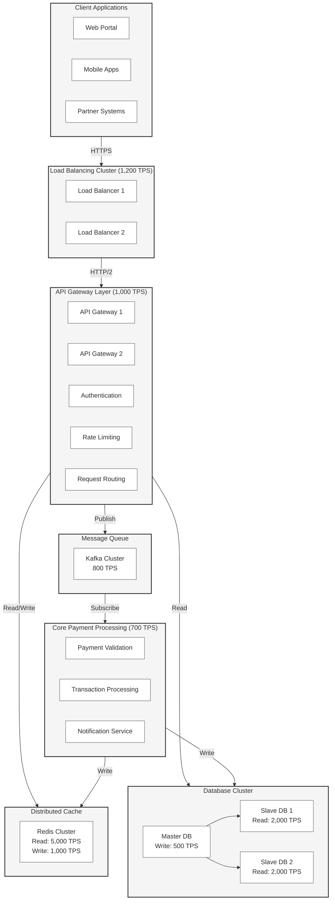

# Title: High-Volume Payment Gateway for Multiple Partners
## Background:
A payment gateway service is handling transactions for 1000 different partners. Each partner processes an average of 10,000 payments per day through API calls to the gateway.
### Key Points:

1. Number of Partners: 1000
2. Average Daily Transactions per Partner: 10,000
3. Total Daily Transactions: 10,000,000 (10 million)
4. Interface: API-based

## Use Case Description:
Design a scalable and reliable payment gateway architecture that can handle a high volume of transactions from multiple partners.
### Requirements:

1. High Availability: The system must be available 24/7 with minimal downtime.
2. Scalability: Must handle 10 million transactions per day with the ability to scale up.
3. Performance: Low latency response times for API calls.
4. Security: Ensure secure handling of sensitive payment information.
5. Partner Management: Ability to onboard, manage, and monitor 1000+ partners.
6. API Design: Robust API design to handle various payment scenarios.
7. Monitoring and Logging: Real-time monitoring of transaction flows and error logging.
8. Compliance: Adhere to relevant financial regulations and standards (e.g., PCI DSS).

### Challenges to Address:

1. Load Balancing: Efficiently distribute incoming API requests across multiple servers.
2. Database Design: Design a database structure that can handle high write loads.
3. Caching Strategy: Implement caching to reduce database load and improve response times.
4. Asynchronous Processing: Consider asynchronous processing for non-critical operations.
5. Partner Isolation: Ensure that issues with one partner don't affect others.
6. Rate Limiting: Implement rate limiting to prevent any single partner from overwhelming the system.
7. Disaster Recovery: Design a robust backup and recovery system.
8. Scalability: Architect the system to easily scale horizontally as the number of partners or transactions increases.

## Discussion Points for the Workshop:

1. What architectural pattern would be most suitable? (e.g., microservices, event-driven)
2. How to design the API for optimal performance and usability?
3. What database technology would be most appropriate for this use case?
4. How to implement real-time monitoring and alerting for such a high-volume system?
5. What security measures should be in place to protect sensitive payment data?
6. How to handle peak loads and traffic spikes?
7. What kind of redundancy should be built into the system?
8. How to manage and version the API for 1000 different partners?

# Payment Gateway Architecture Design

## Component Capacity Specifications
- API Gateway: 1,000 TPS
- Load Balancer: 1,200 TPS
- Message Queue: 800 TPS
- Cache Read: 5,000 TPS
- Cache Write: 1,000 TPS
- Database Read: 2,000 TPS
- Database Write: 500 TPS
- Core Process: 700 TPS

## Traffic Load
- Peak Traffic: 5,000 TPS
- Average Traffic: 500 TPS

```d2
direction: right

# Client Layer
client: Client Applications {
  web: Web Portal
  mobile: Mobile Apps
  partner: Partner Systems
}

# Load Balancing Layer
lb: Load Balancing {
  shape: rectangle
  style.multiple: true
  label: "Load Balancer Cluster\nCapacity: 1,200 TPS\n(Active-Active)"
}

# API Gateway Layer
api: API Gateway Layer {
  shape: rectangle
  style.multiple: true
  label: "API Gateway Cluster\nCapacity: 1,000 TPS"
  
  auth: Authentication
  ratelimit: Rate Limiting
  routing: Request Routing
}

# Caching Layer
cache: Distributed Cache {
  shape: cylinder
  style.multiple: true
  label: "Redis Cluster\nRead: 5,000 TPS\nWrite: 1,000 TPS"
}

# Message Queue Layer
queue: Message Queue {
  shape: queue
  style.multiple: true
  label: "Kafka Cluster\nCapacity: 800 TPS"
}

# Core Processing
core: Core Payment Processing {
  shape: rectangle
  style.multiple: true
  label: "Payment Processors\nCapacity: 700 TPS"
  
  validation: Payment Validation
  processing: Transaction Processing
  notification: Notification Service
}

# Database Layer
db: Database Cluster {
  shape: cylinder
  style.multiple: true
  label: "Database Cluster\nRead: 2,000 TPS\nWrite: 500 TPS"
  
  master: Master DB
  slave1: Slave DB 1
  slave2: Slave DB 2
}

# Define connections
client -> lb: HTTPS
lb -> api: HTTP/2
api -> cache: Read/Write
api -> queue: Publish
api -> db: Read
queue -> core: Subscribe
core -> db: Write
core -> cache: Write

# Add scaling notes
scaling: Scaling Strategy {
  lb_scale: "Load Balancer: Horizontal scaling with\nactive-active configuration"
  api_scale: "API Gateway: Auto-scaling based on\nCPU and request metrics"
  cache_scale: "Cache: Redis cluster with\nread replicas"
  queue_scale: "Queue: Kafka partitioning for\nparallel processing"
  core_scale: "Core: Containerized services with\nauto-scaling"
  db_scale: "Database: Master-slave replication\nwith read distribution"
}
```



## Architecture Highlights

1. **Load Balancing Strategy**
   - Multiple load balancers in active-active configuration
   - Capacity of 1,200 TPS exceeds API Gateway capacity for headroom

2. **API Gateway Layer**
   - Clustered deployment with 1,000 TPS capacity
   - Implements authentication, rate limiting, and request routing
   - Direct connection to cache for session management

3. **Caching Strategy**
   - Redis cluster with high read capacity (5,000 TPS)
   - Write capacity of 1,000 TPS
   - Used for session management, frequent lookups, and rate limiting

4. **Message Queue Implementation**
   - Kafka cluster handling 800 TPS
   - Ensures reliable message delivery and processing
   - Helps handle traffic spikes through buffering

5. **Core Processing**
   - Scaled to handle 700 TPS
   - Multiple processing instances for redundancy
   - Asynchronous processing via message queue

6. **Database Architecture**
   - Master-slave configuration
   - Read capacity: 2,000 TPS (distributed across replicas)
   - Write capacity: 500 TPS (master database)

## Scaling Considerations

1. **Horizontal Scaling**
   - All components support horizontal scaling
   - Auto-scaling based on traffic patterns
   - Container orchestration for dynamic scaling

2. **Traffic Management**
   - Rate limiting at API Gateway
   - Queue buffering for traffic spikes
   - Read/write splitting for database operations

3. **High Availability**
   - Multiple instances of each component
   - Geographic distribution where applicable
   - Automatic failover mechanisms

4. **Performance Optimization**
   - Caching for frequent operations
   - Asynchronous processing for non-critical operations
   - Database read replicas for query distribution

