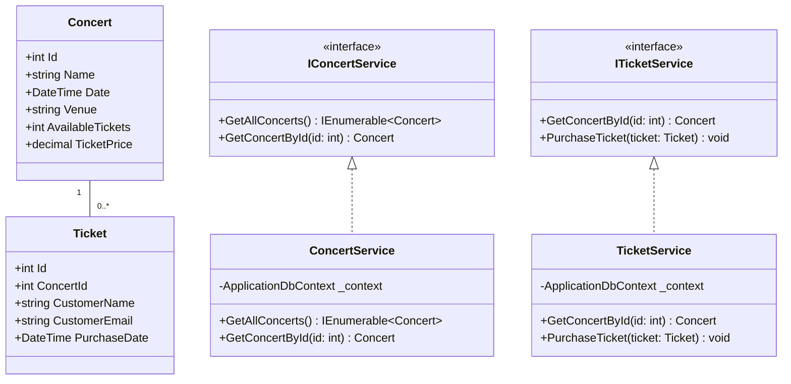

# MVC Class Diagram


## Code Diagram
```csharp
// Models

public class Concert
{
    public int Id { get; set; }
    public string Name { get; set; }
    public DateTime Date { get; set; }
    public string Venue { get; set; }
    public int AvailableTickets { get; set; }
    public decimal TicketPrice { get; set; }
}

public class Ticket
{
    public int Id { get; set; }
    public int ConcertId { get; set; }
    public string CustomerName { get; set; }
    public string CustomerEmail { get; set; }
    public DateTime PurchaseDate { get; set; }
}

// Controllers

public class ConcertController : Controller
{
    private readonly IConcertService _concertService;

    public ConcertController(IConcertService concertService)
    {
        _concertService = concertService;
    }

    public IActionResult Index()
    {
        var concerts = _concertService.GetAllConcerts();
        return View(concerts);
    }

    public IActionResult Details(int id)
    {
        var concert = _concertService.GetConcertById(id);
        if (concert == null)
        {
            return NotFound();
        }
        return View(concert);
    }
}

public class TicketController : Controller
{
    private readonly ITicketService _ticketService;

    public TicketController(ITicketService ticketService)
    {
        _ticketService = ticketService;
    }

    [HttpGet]
    public IActionResult Purchase(int concertId)
    {
        var concert = _ticketService.GetConcertById(concertId);
        if (concert == null || concert.AvailableTickets <= 0)
        {
            return NotFound();
        }
        return View(new Ticket { ConcertId = concertId });
    }

    [HttpPost]
    public IActionResult Purchase(Ticket ticket)
    {
        if (ModelState.IsValid)
        {
            _ticketService.PurchaseTicket(ticket);
            return RedirectToAction("Confirmation", new { id = ticket.Id });
        }
        return View(ticket);
    }
}

// Services

public interface IConcertService
{
    IEnumerable<Concert> GetAllConcerts();
    Concert GetConcertById(int id);
}

public interface ITicketService
{
    Concert GetConcertById(int id);
    void PurchaseTicket(Ticket ticket);
}

public class ConcertService : IConcertService
{
    private readonly ApplicationDbContext _context;

    public ConcertService(ApplicationDbContext context)
    {
        _context = context;
    }

    public IEnumerable<Concert> GetAllConcerts()
    {
        return _context.Concerts.ToList();
    }

    public Concert GetConcertById(int id)
    {
        return _context.Concerts.FirstOrDefault(c => c.Id == id);
    }
}

public class TicketService : ITicketService
{
    private readonly ApplicationDbContext _context;

    public TicketService(ApplicationDbContext context)
    {
        _context = context;
    }

    public Concert GetConcertById(int id)
    {
        return _context.Concerts.FirstOrDefault(c => c.Id == id);
    }

    public void PurchaseTicket(Ticket ticket)
    {
        var concert = _context.Concerts.FirstOrDefault(c => c.Id == ticket.ConcertId);
        if (concert != null && concert.AvailableTickets > 0)
        {
            ticket.PurchaseDate = DateTime.Now;
            _context.Tickets.Add(ticket);
            concert.AvailableTickets--;
            _context.SaveChanges();
        }
        else
        {
            throw new InvalidOperationException("No tickets available for this concert.");
        }
    }
}

// Startup.cs (for Dependency Injection)

public void ConfigureServices(IServiceCollection services)
{
    services.AddDbContext<ApplicationDbContext>(options =>
        options.UseSqlServer(Configuration.GetConnectionString("DefaultConnection")));
    
    services.AddScoped<IConcertService, ConcertService>();
    services.AddScoped<ITicketService, TicketService>();
    
    services.AddControllersWithViews();
}
```