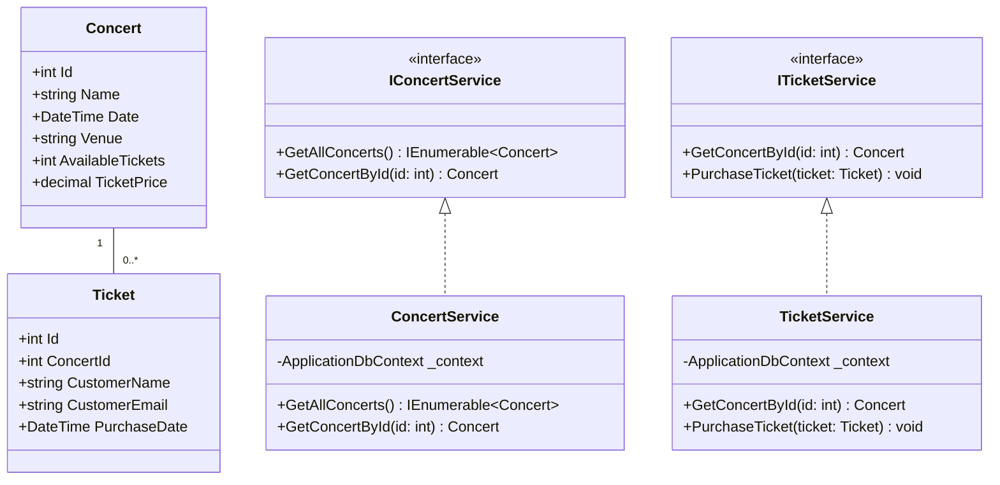

# MVC Class Diagram

## Code Blazor

```csharp
// Models/Concert.cs
public class Concert
{
    public int Id { get; set; }
    public string Name { get; set; }
    public DateTime Date { get; set; }
    public string Venue { get; set; }
    public int AvailableTickets { get; set; }
    public decimal TicketPrice { get; set; }
}

// Models/Ticket.cs
public class Ticket
{
    public int Id { get; set; }
    public int ConcertId { get; set; }
    public string CustomerName { get; set; }
    public string CustomerEmail { get; set; }
    public DateTime PurchaseDate { get; set; }
    
    public Concert Concert { get; set; }
}

// Data/ApplicationDbContext.cs
public class ApplicationDbContext : DbContext
{
    public ApplicationDbContext(DbContextOptions<ApplicationDbContext> options)
        : base(options)
    {
    }

    public DbSet<Concert> Concerts { get; set; }
    public DbSet<Ticket> Tickets { get; set; }

    protected override void OnModelCreating(ModelBuilder modelBuilder)
    {
        modelBuilder.Entity<Ticket>()
            .HasOne(t => t.Concert)
            .WithMany()
            .HasForeignKey(t => t.ConcertId);
    }
}

// Services/IConcertService.cs
public interface IConcertService
{
    Task<IEnumerable<Concert>> GetAllConcerts();
    Task<Concert> GetConcertById(int id);
}

// Services/ITicketService.cs
public interface ITicketService
{
    Task<Concert> GetConcertById(int id);
    Task PurchaseTicket(Ticket ticket);
}

// Services/ConcertService.cs
public class ConcertService : IConcertService
{
    private readonly ApplicationDbContext _context;

    public ConcertService(ApplicationDbContext context)
    {
        _context = context;
    }

    public async Task<IEnumerable<Concert>> GetAllConcerts()
    {
        return await _context.Concerts.ToListAsync();
    }

    public async Task<Concert> GetConcertById(int id)
    {
        return await _context.Concerts.FindAsync(id);
    }
}

// Services/TicketService.cs
public class TicketService : ITicketService
{
    private readonly ApplicationDbContext _context;

    public TicketService(ApplicationDbContext context)
    {
        _context = context;
    }

    public async Task<Concert> GetConcertById(int id)
    {
        return await _context.Concerts.FindAsync(id);
    }

    public async Task PurchaseTicket(Ticket ticket)
    {
        var concert = await _context.Concerts.FindAsync(ticket.ConcertId);
        if (concert == null || concert.AvailableTickets <= 0)
            throw new InvalidOperationException("No tickets available");

        concert.AvailableTickets--;
        ticket.PurchaseDate = DateTime.UtcNow;
        
        _context.Tickets.Add(ticket);
        await _context.SaveChangesAsync();
    }
}

// Pages/Concerts.razor
@page "/concerts"
@inject IConcertService ConcertService

<h3>Available Concerts</h3>

@if (concerts == null)
{
    <p>Loading...</p>
}
else
{
    <div class="row">
        @foreach (var concert in concerts)
        {
            <div class="col-md-4 mb-4">
                <div class="card">
                    <div class="card-body">
                        <h5 class="card-title">@concert.Name</h5>
                        <p class="card-text">
                            Venue: @concert.Venue<br />
                            Date: @concert.Date.ToShortDateString()<br />
                            Available Tickets: @concert.AvailableTickets<br />
                            Price: $@concert.TicketPrice
                        </p>
                        <a href="/purchase/@concert.Id" class="btn btn-primary">
                            Purchase Ticket
                        </a>
                    </div>
                </div>
            </div>
        }
    </div>
}

@code {
    private IEnumerable<Concert> concerts;

    protected override async Task OnInitializedAsync()
    {
        concerts = await ConcertService.GetAllConcerts();
    }
}

// Pages/PurchaseTicket.razor
@page "/purchase/{ConcertId:int}"
@inject ITicketService TicketService
@inject NavigationManager NavigationManager

<h3>Purchase Ticket</h3>

@if (concert == null)
{
    <p>Loading...</p>
}
else
{
    <div class="card mb-4">
        <div class="card-body">
            <h5 class="card-title">@concert.Name</h5>
            <p class="card-text">
                Venue: @concert.Venue<br />
                Date: @concert.Date.ToShortDateString()<br />
                Price: $@concert.TicketPrice
            </p>
        </div>
    </div>

    <EditForm Model="@ticket" OnValidSubmit="@HandleValidSubmit">
        <DataAnnotationsValidator />

        <div class="form-group">
            <label>Name:</label>
            <InputText @bind-Value="ticket.CustomerName" class="form-control" />
            <ValidationMessage For="@(() => ticket.CustomerName)" />
        </div>

        <div class="form-group">
            <label>Email:</label>
            <InputText @bind-Value="ticket.CustomerEmail" class="form-control" />
            <ValidationMessage For="@(() => ticket.CustomerEmail)" />
        </div>

        <button type="submit" class="btn btn-primary mt-3">
            Purchase Ticket
        </button>
    </EditForm>
}

@code {
    [Parameter]
    public int ConcertId { get; set; }

    private Concert concert;
    private Ticket ticket = new Ticket();

    protected override async Task OnInitializedAsync()
    {
        concert = await TicketService.GetConcertById(ConcertId);
        ticket.ConcertId = ConcertId;
    }

    private async Task HandleValidSubmit()
    {
        try
        {
            await TicketService.PurchaseTicket(ticket);
            NavigationManager.NavigateTo("/concerts");
        }
        catch (Exception ex)
        {
            // Handle error (show message to user)
        }
    }
}

// Program.cs
public class Program
{
    public static void Main(string[] args)
    {
        var builder = WebApplication.CreateBuilder(args);

        builder.Services.AddDbContext<ApplicationDbContext>(options =>
            options.UseSqlServer(builder.Configuration.GetConnectionString("DefaultConnection")));

        builder.Services.AddScoped<IConcertService, ConcertService>();
        builder.Services.AddScoped<ITicketService, TicketService>();

        builder.Services.AddRazorPages();
        builder.Services.AddServerSideBlazor();

        var app = builder.Build();

        // Configure middleware
        if (app.Environment.IsDevelopment())
        {
            app.UseDeveloperExceptionPage();
        }

        app.UseStaticFiles();
        app.UseRouting();

        app.MapBlazorHub();
        app.MapFallbackToPage("/_Host");

        app.Run();
    }
}
```

## Code Diagram
```csharp
// Models

public class Concert
{
    public int Id { get; set; }
    public string Name { get; set; }
    public DateTime Date { get; set; }
    public string Venue { get; set; }
    public int AvailableTickets { get; set; }
    public decimal TicketPrice { get; set; }
}

public class Ticket
{
    public int Id { get; set; }
    public int ConcertId { get; set; }
    public string CustomerName { get; set; }
    public string CustomerEmail { get; set; }
    public DateTime PurchaseDate { get; set; }
}

// Controllers

public class ConcertController : Controller
{
    private readonly IConcertService _concertService;

    public ConcertController(IConcertService concertService)
    {
        _concertService = concertService;
    }

    public IActionResult Index()
    {
        var concerts = _concertService.GetAllConcerts();
        return View(concerts);
    }

    public IActionResult Details(int id)
    {
        var concert = _concertService.GetConcertById(id);
        if (concert == null)
        {
            return NotFound();
        }
        return View(concert);
    }
}

public class TicketController : Controller
{
    private readonly ITicketService _ticketService;

    public TicketController(ITicketService ticketService)
    {
        _ticketService = ticketService;
    }

    [HttpGet]
    public IActionResult Purchase(int concertId)
    {
        var concert = _ticketService.GetConcertById(concertId);
        if (concert == null || concert.AvailableTickets <= 0)
        {
            return NotFound();
        }
        return View(new Ticket { ConcertId = concertId });
    }

    [HttpPost]
    public IActionResult Purchase(Ticket ticket)
    {
        if (ModelState.IsValid)
        {
            _ticketService.PurchaseTicket(ticket);
            return RedirectToAction("Confirmation", new { id = ticket.Id });
        }
        return View(ticket);
    }
}

// Services

public interface IConcertService
{
    IEnumerable<Concert> GetAllConcerts();
    Concert GetConcertById(int id);
}

public interface ITicketService
{
    Concert GetConcertById(int id);
    void PurchaseTicket(Ticket ticket);
}

public class ConcertService : IConcertService
{
    private readonly ApplicationDbContext _context;

    public ConcertService(ApplicationDbContext context)
    {
        _context = context;
    }

    public IEnumerable<Concert> GetAllConcerts()
    {
        return _context.Concerts.ToList();
    }

    public Concert GetConcertById(int id)
    {
        return _context.Concerts.FirstOrDefault(c => c.Id == id);
    }
}

public class TicketService : ITicketService
{
    private readonly ApplicationDbContext _context;

    public TicketService(ApplicationDbContext context)
    {
        _context = context;
    }

    public Concert GetConcertById(int id)
    {
        return _context.Concerts.FirstOrDefault(c => c.Id == id);
    }

    public void PurchaseTicket(Ticket ticket)
    {
        var concert = _context.Concerts.FirstOrDefault(c => c.Id == ticket.ConcertId);
        if (concert != null && concert.AvailableTickets > 0)
        {
            ticket.PurchaseDate = DateTime.Now;
            _context.Tickets.Add(ticket);
            concert.AvailableTickets--;
            _context.SaveChanges();
        }
        else
        {
            throw new InvalidOperationException("No tickets available for this concert.");
        }
    }
}

// Startup.cs (for Dependency Injection)

public void ConfigureServices(IServiceCollection services)
{
    services.AddDbContext<ApplicationDbContext>(options =>
        options.UseSqlServer(Configuration.GetConnectionString("DefaultConnection")));
    
    services.AddScoped<IConcertService, ConcertService>();
    services.AddScoped<ITicketService, TicketService>();
    
    services.AddControllersWithViews();
}
```