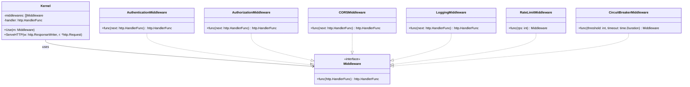

# Micro Kernel
## Class Diagram

## Flow Diagram


## Code
```go
package main

import (
	"context"
	"fmt"
	"log"
	"net/http"
	"sync"
	"time"

	"golang.org/x/time/rate"
)

// Kernel represents the core of the microkernel architecture
type Kernel struct {
	middlewares []Middleware
	handler     http.HandlerFunc
}

// Middleware is a higher-order function that wraps an http.HandlerFunc
type Middleware func(http.HandlerFunc) http.HandlerFunc

// Use adds a middleware to the kernel
func (k *Kernel) Use(m Middleware) {
	k.middlewares = append(k.middlewares, m)
}

// ServeHTTP implements the http.Handler interface
func (k *Kernel) ServeHTTP(w http.ResponseWriter, r *http.Request) {
	handler := k.handler
	for i := len(k.middlewares) - 1; i >= 0; i-- {
		handler = k.middlewares[i](handler)
	}
	handler(w, r)
}

// Authentication middleware
func AuthenticationMiddleware(next http.HandlerFunc) http.HandlerFunc {
	return func(w http.ResponseWriter, r *http.Request) {
		token := r.Header.Get("Authorization")
		if token != "valid-token" {
			http.Error(w, "Unauthorized", http.StatusUnauthorized)
			return
		}
		next(w, r)
	}
}

// Authorization middleware
func AuthorizationMiddleware(next http.HandlerFunc) http.HandlerFunc {
	return func(w http.ResponseWriter, r *http.Request) {
		role := r.Header.Get("Role")
		if role != "admin" {
			http.Error(w, "Forbidden", http.StatusForbidden)
			return
		}
		next(w, r)
	}
}

// CORS middleware
func CORSMiddleware(next http.HandlerFunc) http.HandlerFunc {
	return func(w http.ResponseWriter, r *http.Request) {
		w.Header().Set("Access-Control-Allow-Origin", "*")
		w.Header().Set("Access-Control-Allow-Methods", "GET, POST, OPTIONS")
		w.Header().Set("Access-Control-Allow-Headers", "Content-Type, Authorization")
		if r.Method == "OPTIONS" {
			w.WriteHeader(http.StatusOK)
			return
		}
		next(w, r)
	}
}

// Logging middleware
func LoggingMiddleware(next http.HandlerFunc) http.HandlerFunc {
	return func(w http.ResponseWriter, r *http.Request) {
		start := time.Now()
		next(w, r)
		log.Printf("%s %s %v", r.Method, r.URL.Path, time.Since(start))
	}
}

// RateLimit middleware
func RateLimitMiddleware(rps int) Middleware {
	limiter := rate.NewLimiter(rate.Limit(rps), rps)
	return func(next http.HandlerFunc) http.HandlerFunc {
		return func(w http.ResponseWriter, r *http.Request) {
			if !limiter.Allow() {
				http.Error(w, "Too Many Requests", http.StatusTooManyRequests)
				return
			}
			next(w, r)
		}
	}
}

// CircuitBreaker middleware
func CircuitBreakerMiddleware(threshold int, timeout time.Duration) Middleware {
	var (
		failures  int
		lastRetry time.Time
		mu        sync.Mutex
	)

	return func(next http.HandlerFunc) http.HandlerFunc {
		return func(w http.ResponseWriter, r *http.Request) {
			mu.Lock()
			if failures >= threshold && time.Since(lastRetry) < timeout {
				mu.Unlock()
				http.Error(w, "Service Unavailable", http.StatusServiceUnavailable)
				return
			}
			mu.Unlock()

			ctx, cancel := context.WithTimeout(r.Context(), 2*time.Second)
			defer cancel()

			done := make(chan bool)
			go func() {
				next(w, r.WithContext(ctx))
				done <- true
			}()

			select {
			case <-done:
				mu.Lock()
				failures = 0
				mu.Unlock()
			case <-ctx.Done():
				mu.Lock()
				failures++
				if failures == threshold {
					lastRetry = time.Now()
				}
				mu.Unlock()
				http.Error(w, "Request Timeout", http.StatusRequestTimeout)
			}
		}
	}
}

func main() {
	kernel := &Kernel{
		handler: func(w http.ResponseWriter, r *http.Request) {
			fmt.Fprintln(w, "Hello from the microkernel!")
		},
	}

	kernel.Use(LoggingMiddleware)
	kernel.Use(CORSMiddleware)
	kernel.Use(AuthenticationMiddleware)
	kernel.Use(AuthorizationMiddleware)
	kernel.Use(RateLimitMiddleware(10))
	kernel.Use(CircuitBreakerMiddleware(5, 30*time.Second))

	http.ListenAndServe(":8080", kernel)
}

```