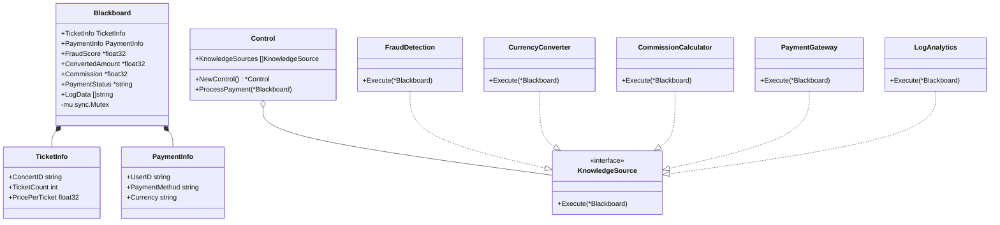
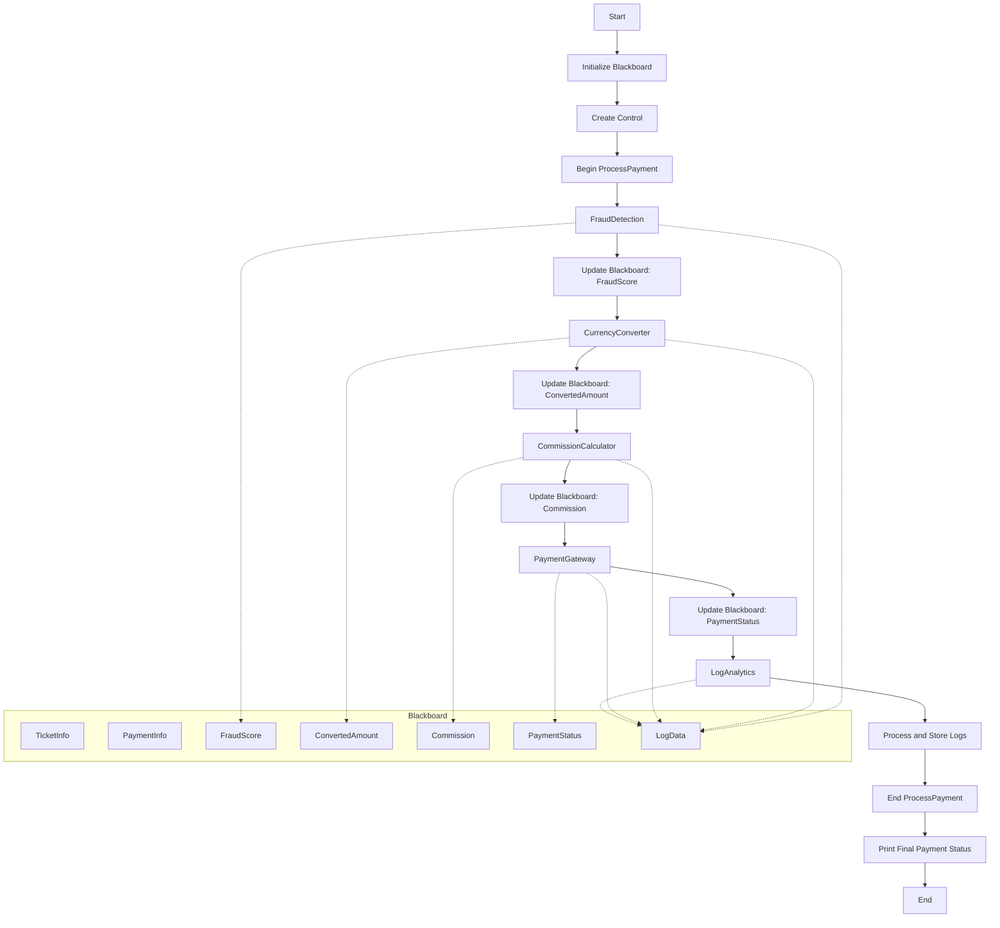

# Blackboard
## Class Diagram

## Flow

## Code
```go
package main

import (
	"fmt"
	"sync"
)

// Blackboard structure to hold shared data
type Blackboard struct {
	TicketInfo     TicketInfo
	PaymentInfo    PaymentInfo
	FraudScore     *float32
	ConvertedAmount *float32
	Commission     *float32
	PaymentStatus  *string
	LogData        []string
	mu             sync.Mutex
}

type TicketInfo struct {
	ConcertID      string
	TicketCount    int
	PricePerTicket float32
}

type PaymentInfo struct {
	UserID        string
	PaymentMethod string
	Currency      string
}

// KnowledgeSource interface
type KnowledgeSource interface {
	Execute(*Blackboard)
}

// FraudDetection knowledge source
type FraudDetection struct{}

func (fd FraudDetection) Execute(bb *Blackboard) {
	fmt.Println("Performing fraud detection...")
	bb.mu.Lock()
	defer bb.mu.Unlock()
	fraudScore := float32(0.2) // Example score, lower is better
	bb.FraudScore = &fraudScore
	bb.LogData = append(bb.LogData, fmt.Sprintf("Fraud score: %f", fraudScore))
}

// CurrencyConverter knowledge source
type CurrencyConverter struct{}

func (cc CurrencyConverter) Execute(bb *Blackboard) {
	fmt.Println("Converting currency...")
	bb.mu.Lock()
	defer bb.mu.Unlock()
	totalAmount := bb.TicketInfo.PricePerTicket * float32(bb.TicketInfo.TicketCount)
	conversionRate := float32(1.2) // Example rate
	convertedAmount := totalAmount * conversionRate
	bb.ConvertedAmount = &convertedAmount
	bb.LogData = append(bb.LogData, fmt.Sprintf("Converted amount: %f", convertedAmount))
}

// CommissionCalculator knowledge source
type CommissionCalculator struct{}

func (cc CommissionCalculator) Execute(bb *Blackboard) {
	fmt.Println("Calculating commission...")
	bb.mu.Lock()
	defer bb.mu.Unlock()
	if bb.ConvertedAmount != nil {
		commissionRate := float32(0.05) // 5% commission
		commission := *bb.ConvertedAmount * commissionRate
		bb.Commission = &commission
		bb.LogData = append(bb.LogData, fmt.Sprintf("Commission: %f", commission))
	}
}

// PaymentGateway knowledge source
type PaymentGateway struct{}

func (pg PaymentGateway) Execute(bb *Blackboard) {
	fmt.Println("Processing payment...")
	bb.mu.Lock()
	defer bb.mu.Unlock()
	if bb.ConvertedAmount != nil && bb.Commission != nil {
		totalCharge := *bb.ConvertedAmount + *bb.Commission
		// In a real scenario, we would integrate with an actual payment gateway here
		paymentSuccessful := true // Simulated result
		status := "Success"
		if !paymentSuccessful {
			status = "Failed"
		}
		bb.PaymentStatus = &status
		bb.LogData = append(bb.LogData, fmt.Sprintf("Payment status: %s", status))
	}
}

// LogAnalytics knowledge source
type LogAnalytics struct{}

func (la LogAnalytics) Execute(bb *Blackboard) {
	fmt.Println("Analyzing and storing logs...")
	bb.mu.Lock()
	defer bb.mu.Unlock()
	// In a real scenario, we might send these logs to a centralized logging system
	for _, log := range bb.LogData {
		fmt.Printf("Log: %s\n", log)
	}
}

// Control component
type Control struct {
	KnowledgeSources []KnowledgeSource
}

func NewControl() *Control {
	return &Control{
		KnowledgeSources: []KnowledgeSource{
			FraudDetection{},
			CurrencyConverter{},
			CommissionCalculator{},
			PaymentGateway{},
			LogAnalytics{},
		},
	}
}

func (c *Control) ProcessPayment(bb *Blackboard) {
	for _, ks := range c.KnowledgeSources {
		ks.Execute(bb)
	}
}

func main() {
	bb := &Blackboard{
		TicketInfo: TicketInfo{
			ConcertID:      "CONCERT123",
			TicketCount:    2,
			PricePerTicket: 50.0,
		},
		PaymentInfo: PaymentInfo{
			UserID:        "USER456",
			PaymentMethod: "Credit Card",
			Currency:      "USD",
		},
	}

	control := NewControl()
	control.ProcessPayment(bb)

	fmt.Println("Payment processing completed.")
	if bb.PaymentStatus != nil {
		fmt.Printf("Final payment status: %s\n", *bb.PaymentStatus)
	}
}

```

```rust
use std::collections::HashMap;
use std::sync::{Arc, Mutex};

// Blackboard structure to hold shared data
struct Blackboard {
    ticket_info: TicketInfo,
    payment_info: PaymentInfo,
    fraud_score: Option<f32>,
    converted_amount: Option<f32>,
    commission: Option<f32>,
    payment_status: Option<String>,
    log_data: Vec<String>,
}

struct TicketInfo {
    concert_id: String,
    ticket_count: u32,
    price_per_ticket: f32,
}

struct PaymentInfo {
    user_id: String,
    payment_method: String,
    currency: String,
}

// Knowledge Sources
trait KnowledgeSource {
    fn execute(&self, blackboard: &mut Blackboard);
}

struct FraudDetection;
impl KnowledgeSource for FraudDetection {
    fn execute(&self, blackboard: &mut Blackboard) {
        println!("Performing fraud detection...");
        // Simulate fraud detection logic
        let fraud_score = 0.2; // Example score, lower is better
        blackboard.fraud_score = Some(fraud_score);
        blackboard.log_data.push(format!("Fraud score: {}", fraud_score));
    }
}

struct CurrencyConverter;
impl KnowledgeSource for CurrencyConverter {
    fn execute(&self, blackboard: &mut Blackboard) {
        println!("Converting currency...");
        // Simulate currency conversion
        let total_amount = blackboard.ticket_info.price_per_ticket * blackboard.ticket_info.ticket_count as f32;
        let conversion_rate = 1.2; // Example rate
        let converted_amount = total_amount * conversion_rate;
        blackboard.converted_amount = Some(converted_amount);
        blackboard.log_data.push(format!("Converted amount: {}", converted_amount));
    }
}

struct CommissionCalculator;
impl KnowledgeSource for CommissionCalculator {
    fn execute(&self, blackboard: &mut Blackboard) {
        println!("Calculating commission...");
        if let Some(converted_amount) = blackboard.converted_amount {
            let commission_rate = 0.05; // 5% commission
            let commission = converted_amount * commission_rate;
            blackboard.commission = Some(commission);
            blackboard.log_data.push(format!("Commission: {}", commission));
        }
    }
}

struct PaymentGateway;
impl KnowledgeSource for PaymentGateway {
    fn execute(&self, blackboard: &mut Blackboard) {
        println!("Processing payment...");
        // Simulate payment processing
        if let (Some(converted_amount), Some(commission)) = (blackboard.converted_amount, blackboard.commission) {
            let total_charge = converted_amount + commission;
            // In a real scenario, we would integrate with an actual payment gateway here
            let payment_successful = true; // Simulated result
            blackboard.payment_status = Some(if payment_successful { "Success".to_string() } else { "Failed".to_string() });
            blackboard.log_data.push(format!("Payment status: {}", blackboard.payment_status.as_ref().unwrap()));
        }
    }
}

struct LogAnalytics;
impl KnowledgeSource for LogAnalytics {
    fn execute(&self, blackboard: &mut Blackboard) {
        println!("Analyzing and storing logs...");
        // In a real scenario, we might send these logs to a centralized logging system
        for log in &blackboard.log_data {
            println!("Log: {}", log);
        }
    }
}

// Control component
struct Control {
    knowledge_sources: Vec<Box<dyn KnowledgeSource>>,
}

impl Control {
    fn new() -> Self {
        Control {
            knowledge_sources: vec![
                Box::new(FraudDetection),
                Box::new(CurrencyConverter),
                Box::new(CommissionCalculator),
                Box::new(PaymentGateway),
                Box::new(LogAnalytics),
            ],
        }
    }

    fn process_payment(&self, blackboard: &mut Blackboard) {
        for ks in &self.knowledge_sources {
            ks.execute(blackboard);
        }
    }
}

fn main() {
    let mut blackboard = Blackboard {
        ticket_info: TicketInfo {
            concert_id: "CONCERT123".to_string(),
            ticket_count: 2,
            price_per_ticket: 50.0,
        },
        payment_info: PaymentInfo {
            user_id: "USER456".to_string(),
            payment_method: "Credit Card".to_string(),
            currency: "USD".to_string(),
        },
        fraud_score: None,
        converted_amount: None,
        commission: None,
        payment_status: None,
        log_data: Vec::new(),
    };

    let control = Control::new();
    control.process_payment(&mut blackboard);

    println!("Payment processing completed.");
    if let Some(status) = blackboard.payment_status {
        println!("Final payment status: {}", status);
    }
}

```
