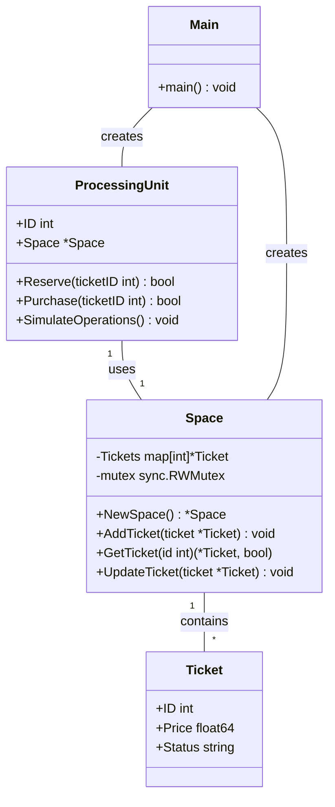
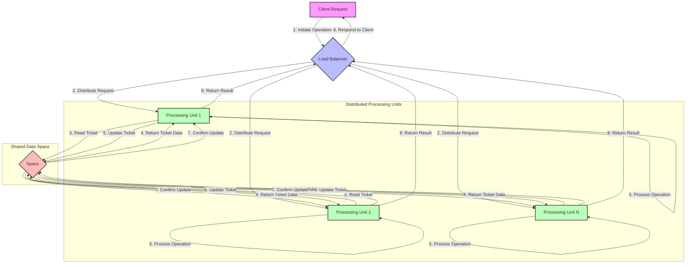

# Space Based
## Class Diagram



## Flow Diagram


## Code
```go
package main

import (
	"fmt"
	"math/rand"
	"sync"
	"time"
)

// Ticket represents a concert ticket
type Ticket struct {
	ID     int
	Price  float64
	Status string
}

// Space represents our virtual space for tickets
type Space struct {
	Tickets map[int]*Ticket
	mutex   sync.RWMutex
}

// NewSpace creates a new ticket space
func NewSpace() *Space {
	return &Space{
		Tickets: make(map[int]*Ticket),
	}
}

// AddTicket adds a ticket to the space
func (s *Space) AddTicket(ticket *Ticket) {
	s.mutex.Lock()
	defer s.mutex.Unlock()
	s.Tickets[ticket.ID] = ticket
}

// GetTicket retrieves a ticket from the space
func (s *Space) GetTicket(id int) (*Ticket, bool) {
	s.mutex.RLock()
	defer s.mutex.RUnlock()
	ticket, exists := s.Tickets[id]
	return ticket, exists
}

// UpdateTicket updates a ticket in the space
func (s *Space) UpdateTicket(ticket *Ticket) {
	s.mutex.Lock()
	defer s.mutex.Unlock()
	s.Tickets[ticket.ID] = ticket
}

// Processing Unit represents a unit that processes ticket operations
type ProcessingUnit struct {
	ID    int
	Space *Space
}

// Reserve attempts to reserve a ticket
func (pu *ProcessingUnit) Reserve(ticketID int) bool {
	ticket, exists := pu.Space.GetTicket(ticketID)
	if !exists || ticket.Status != "Available" {
		return false
	}
	
	ticket.Status = "Reserved"
	pu.Space.UpdateTicket(ticket)
	fmt.Printf("Processing Unit %d: Reserved ticket %d\n", pu.ID, ticketID)
	return true
}

// Purchase completes the purchase of a reserved ticket
func (pu *ProcessingUnit) Purchase(ticketID int) bool {
	ticket, exists := pu.Space.GetTicket(ticketID)
	if !exists || ticket.Status != "Reserved" {
		return false
	}
	
	ticket.Status = "Sold"
	pu.Space.UpdateTicket(ticket)
	fmt.Printf("Processing Unit %d: Purchased ticket %d\n", pu.ID, ticketID)
	return true
}

// Simulate ticket operations
func (pu *ProcessingUnit) SimulateOperations() {
	for {
		ticketID := rand.Intn(100) + 1
		if rand.Float32() < 0.7 { // 70% chance to attempt reservation
			if pu.Reserve(ticketID) {
				time.Sleep(time.Millisecond * time.Duration(rand.Intn(100)))
				pu.Purchase(ticketID)
			}
		}
		time.Sleep(time.Millisecond * time.Duration(rand.Intn(100)))
	}
}

func main() {
	space := NewSpace()
	
	// Initialize tickets
	for i := 1; i <= 100; i++ {
		space.AddTicket(&Ticket{
			ID:     i,
			Price:  50.0 + float64(rand.Intn(50)),
			Status: "Available",
		})
	}
	
	// Create processing units
	for i := 1; i <= 5; i++ {
		pu := &ProcessingUnit{ID: i, Space: space}
		go pu.SimulateOperations()
	}
	
	// Let the simulation run for a while
	time.Sleep(time.Second * 10)
	
	// Print final ticket statuses
	for id, ticket := range space.Tickets {
		fmt.Printf("Ticket %d: Status - %s, Price - $%.2f\n", id, ticket.Status, ticket.Price)
	}
}

```