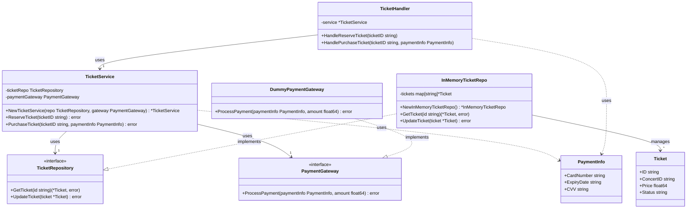

# Hexagonal
## Class Diagram

## Flow Diagram

## Code
```go
package main

import (
	"errors"
	"fmt"
	"time"
)

// Domain Entities
type Ticket struct {
	ID       string
	ConcertID string
	Price    float64
	Status   string
}

// Core Application Service (Hexagon)
type TicketService struct {
	ticketRepo TicketRepository
	paymentGateway PaymentGateway
}

func NewTicketService(repo TicketRepository, gateway PaymentGateway) *TicketService {
	return &TicketService{
		ticketRepo: repo,
		paymentGateway: gateway,
	}
}

func (s *TicketService) ReserveTicket(ticketID string) error {
	ticket, err := s.ticketRepo.GetTicket(ticketID)
	if err != nil {
		return err
	}
	if ticket.Status != "Available" {
		return errors.New("ticket not available")
	}
	ticket.Status = "Reserved"
	return s.ticketRepo.UpdateTicket(ticket)
}

func (s *TicketService) PurchaseTicket(ticketID string, paymentInfo PaymentInfo) error {
	ticket, err := s.ticketRepo.GetTicket(ticketID)
	if err != nil {
		return err
	}
	if ticket.Status != "Reserved" {
		return errors.New("ticket not reserved")
	}
	err = s.paymentGateway.ProcessPayment(paymentInfo, ticket.Price)
	if err != nil {
		return err
	}
	ticket.Status = "Sold"
	return s.ticketRepo.UpdateTicket(ticket)
}

// Ports (Interfaces)
type TicketRepository interface {
	GetTicket(id string) (*Ticket, error)
	UpdateTicket(ticket *Ticket) error
}

type PaymentGateway interface {
	ProcessPayment(paymentInfo PaymentInfo, amount float64) error
}

type PaymentInfo struct {
	CardNumber string
	ExpiryDate string
	CVV        string
}

// Adapters (Implementations of Ports)
type InMemoryTicketRepo struct {
	tickets map[string]*Ticket
}

func NewInMemoryTicketRepo() *InMemoryTicketRepo {
	return &InMemoryTicketRepo{
		tickets: make(map[string]*Ticket),
	}
}

func (r *InMemoryTicketRepo) GetTicket(id string) (*Ticket, error) {
	ticket, exists := r.tickets[id]
	if !exists {
		return nil, errors.New("ticket not found")
	}
	return ticket, nil
}

func (r *InMemoryTicketRepo) UpdateTicket(ticket *Ticket) error {
	r.tickets[ticket.ID] = ticket
	return nil
}

type DummyPaymentGateway struct{}

func (g *DummyPaymentGateway) ProcessPayment(paymentInfo PaymentInfo, amount float64) error {
	// Simulate payment processing
	time.Sleep(time.Millisecond * 500)
	fmt.Printf("Processing payment of $%.2f\n", amount)
	return nil
}

// UI Adapter (could be a CLI, REST API, gRPC, etc.)
type TicketHandler struct {
	service *TicketService
}

func (h *TicketHandler) HandleReserveTicket(ticketID string) {
	err := h.service.ReserveTicket(ticketID)
	if err != nil {
		fmt.Printf("Error reserving ticket: %v\n", err)
		return
	}
	fmt.Println("Ticket reserved successfully")
}

func (h *TicketHandler) HandlePurchaseTicket(ticketID string, paymentInfo PaymentInfo) {
	err := h.service.PurchaseTicket(ticketID, paymentInfo)
	if err != nil {
		fmt.Printf("Error purchasing ticket: %v\n", err)
		return
	}
	fmt.Println("Ticket purchased successfully")
}

func main() {
	// Set up the hexagonal architecture
	repo := NewInMemoryTicketRepo()
	gateway := &DummyPaymentGateway{}
	service := NewTicketService(repo, gateway)
	handler := &TicketHandler{service: service}

	// Populate some sample data
	repo.tickets["T1"] = &Ticket{ID: "T1", ConcertID: "C1", Price: 100.0, Status: "Available"}
	repo.tickets["T2"] = &Ticket{ID: "T2", ConcertID: "C1", Price: 100.0, Status: "Available"}

	// Simulate ticket reservation and purchase
	handler.HandleReserveTicket("T1")
	handler.HandlePurchaseTicket("T1", PaymentInfo{CardNumber: "1234-5678-9012-3456", ExpiryDate: "12/25", CVV: "123"})

	// Try to reserve an already sold ticket
	handler.HandleReserveTicket("T1")

	// Reserve and purchase another ticket
	handler.HandleReserveTicket("T2")
	handler.HandlePurchaseTicket("T2", PaymentInfo{CardNumber: "9876-5432-1098-7654", ExpiryDate: "11/24", CVV: "456"})
}

```