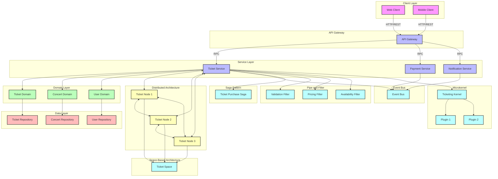

# All in one

## Architecture

```mermaid
graph TB
    subgraph "Client Layer"
        A[Web Client]
        B[Mobile Client]
    end

    subgraph "API Gateway"
        C[API Gateway]
    end

    subgraph "Service Layer"
        D[Ticket Service]
        E[Payment Service]
        F[Notification Service]
    end

    subgraph "Domain Layer"
        G[Ticket Domain]
        H[Concert Domain]
        I[User Domain]
    end

    subgraph "Data Layer"
        J[Ticket Repository]
        K[Concert Repository]
        L[User Repository]
    end

    subgraph "Distributed Architecture"
        M[Ticket Node 1]
        N[Ticket Node 2]
        O[Ticket Node 3]
    end

    subgraph "Event Bus"
        P[Event Bus]
    end

    subgraph "Space-Based Architecture"
        Q[Ticket Space]
    end

    subgraph "Saga Pattern"
        R[Ticket Purchase Saga]
    end

    subgraph "Pipe and Filter"
        S[Validation Filter]
        T[Pricing Filter]
        U[Availability Filter]
    end

    subgraph "Microkernel"
        V[Ticketing Kernel]
        W[Plugin 1]
        X[Plugin 2]
    end

    A -->|HTTP/REST| C
    B -->|HTTP/REST| C
    C -->|RPC| D
    C -->|RPC| E
    C -->|RPC| F
    D --> G
    D --> H
    D --> I
    G --> J
    H --> K
    I --> L
    D <--> M
    D <--> N
    D <--> O
    M <--> N
    N <--> O
    O <--> M
    D --> P
    E --> P
    F --> P
    M --> Q
    N --> Q
    O --> Q
    D --> R
    D --> S
    D --> T
    D --> U
    V --> W
    V --> X
    D --> V

    classDef client fill:#f9f,stroke:#333,stroke-width:2px;
    classDef service fill:#bbf,stroke:#333,stroke-width:2px;
    classDef domain fill:#bfb,stroke:#333,stroke-width:2px;
    classDef data fill:#fbb,stroke:#333,stroke-width:2px;
    classDef distributed fill:#ffb,stroke:#333,stroke-width:2px;
    classDef infrastructure fill:#bff,stroke:#333,stroke-width:2px;
    class A,B client;
    class C,D,E,F service;
    class G,H,I domain;
    class J,K,L data;
    class M,N,O distributed;
    class P,Q,R,S,T,U,V,W,X infrastructure;

```
