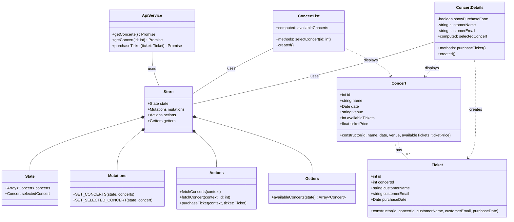
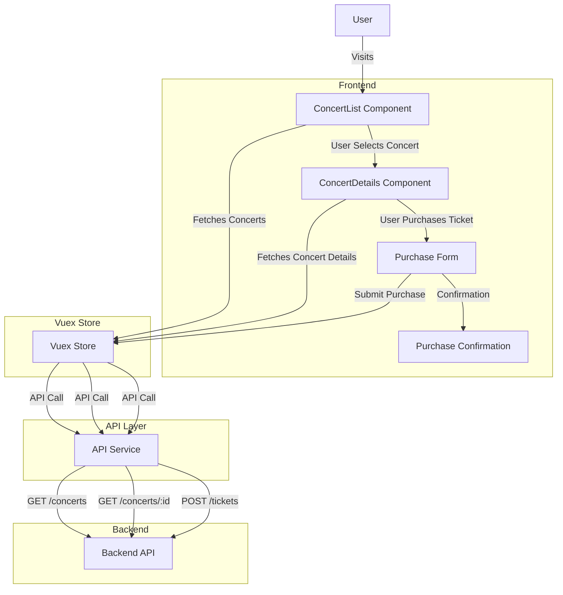

# MVVM Class Diagram

## Flow


## Code
```js
// src/models/Concert.js
export class Concert {
  constructor(id, name, date, venue, availableTickets, ticketPrice) {
    this.id = id;
    this.name = name;
    this.date = date;
    this.venue = venue;
    this.availableTickets = availableTickets;
    this.ticketPrice = ticketPrice;
  }
}

// src/models/Ticket.js
export class Ticket {
  constructor(id, concertId, customerName, customerEmail, purchaseDate) {
    this.id = id;
    this.concertId = concertId;
    this.customerName = customerName;
    this.customerEmail = customerEmail;
    this.purchaseDate = purchaseDate;
  }
}

// src/services/api.js
import axios from 'axios';

const API_URL = 'https://api.example.com';

export default {
  async getConcerts() {
    const response = await axios.get(`${API_URL}/concerts`);
    return response.data;
  },
  async getConcert(id) {
    const response = await axios.get(`${API_URL}/concerts/${id}`);
    return response.data;
  },
  async purchaseTicket(ticket) {
    const response = await axios.post(`${API_URL}/tickets`, ticket);
    return response.data;
  }
};

// src/store/index.js
import { createStore } from 'vuex';
import api from '../services/api';

export default createStore({
  state: {
    concerts: [],
    selectedConcert: null,
  },
  mutations: {
    SET_CONCERTS(state, concerts) {
      state.concerts = concerts;
    },
    SET_SELECTED_CONCERT(state, concert) {
      state.selectedConcert = concert;
    },
  },
  actions: {
    async fetchConcerts({ commit }) {
      const concerts = await api.getConcerts();
      commit('SET_CONCERTS', concerts);
    },
    async fetchConcert({ commit }, id) {
      const concert = await api.getConcert(id);
      commit('SET_SELECTED_CONCERT', concert);
    },
    async purchaseTicket(_, ticket) {
      await api.purchaseTicket(ticket);
    },
  },
  getters: {
    availableConcerts: (state) => state.concerts.filter(c => c.availableTickets > 0),
  },
});

// src/components/ConcertList.vue
<template>
  <div>
    <h2>Available Concerts</h2>
    <ul>
      <li v-for="concert in availableConcerts" :key="concert.id">
        {{ concert.name }} - {{ concert.date }} - {{ concert.venue }}
        <button @click="selectConcert(concert.id)">View Details</button>
      </li>
    </ul>
  </div>
</template>

<script>
import { mapGetters, mapActions } from 'vuex';

export default {
  name: 'ConcertList',
  computed: {
    ...mapGetters(['availableConcerts']),
  },
  methods: {
    ...mapActions(['fetchConcerts', 'fetchConcert']),
    selectConcert(id) {
      this.fetchConcert(id);
      this.$router.push({ name: 'ConcertDetails', params: { id } });
    },
  },
  created() {
    this.fetchConcerts();
  },
};
</script>

// src/components/ConcertDetails.vue
<template>
  <div v-if="selectedConcert">
    <h2>{{ selectedConcert.name }}</h2>
    <p>Date: {{ selectedConcert.date }}</p>
    <p>Venue: {{ selectedConcert.venue }}</p>
    <p>Available Tickets: {{ selectedConcert.availableTickets }}</p>
    <p>Price: ${{ selectedConcert.ticketPrice }}</p>
    <button @click="showPurchaseForm = true">Purchase Ticket</button>

    <div v-if="showPurchaseForm">
      <h3>Purchase Ticket</h3>
      <form @submit.prevent="purchaseTicket">
        <input v-model="customerName" placeholder="Your Name" required>
        <input v-model="customerEmail" type="email" placeholder="Your Email" required>
        <button type="submit">Confirm Purchase</button>
      </form>
    </div>
  </div>
</template>
```
```js
<script>
import { mapState, mapActions } from 'vuex';
import { Ticket } from '../models/Ticket';

export default {
  name: 'ConcertDetails',
  data() {
    return {
      showPurchaseForm: false,
      customerName: '',
      customerEmail: '',
    };
  },
  computed: {
    ...mapState(['selectedConcert']),
  },
  methods: {
    ...mapActions(['fetchConcert', 'purchaseTicket']),
    async purchaseTicket() {
      const ticket = new Ticket(
        null,
        this.selectedConcert.id,
        this.customerName,
        this.customerEmail,
        new Date()
      );
      await this.purchaseTicket(ticket);
      this.showPurchaseForm = false;
      this.$router.push({ name: 'PurchaseConfirmation' });
    },
  },
  created() {
    this.fetchConcert(this.$route.params.id);
  },
};
</script>

```