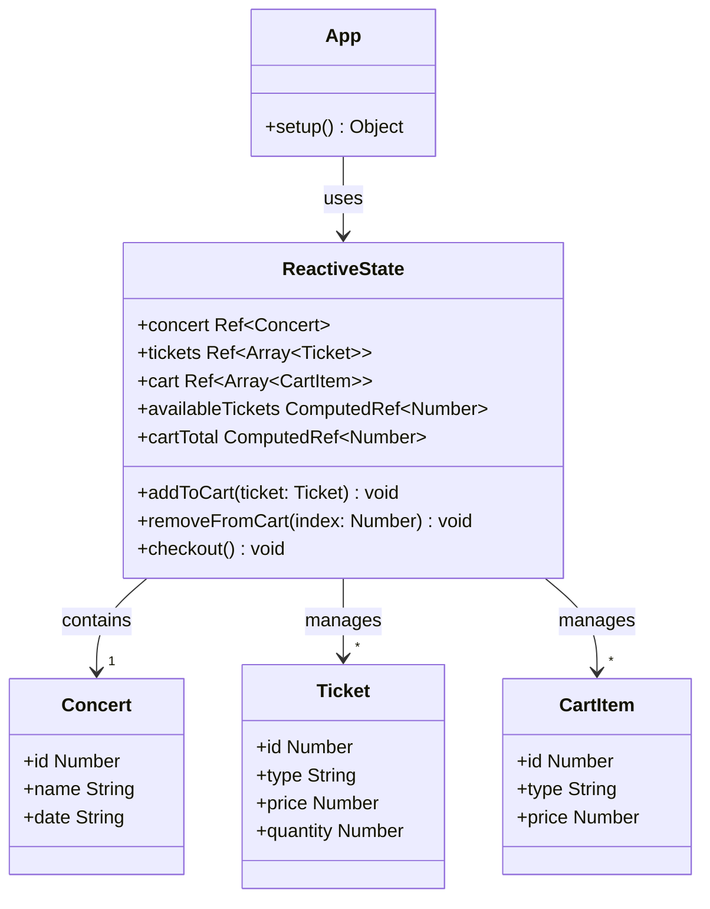
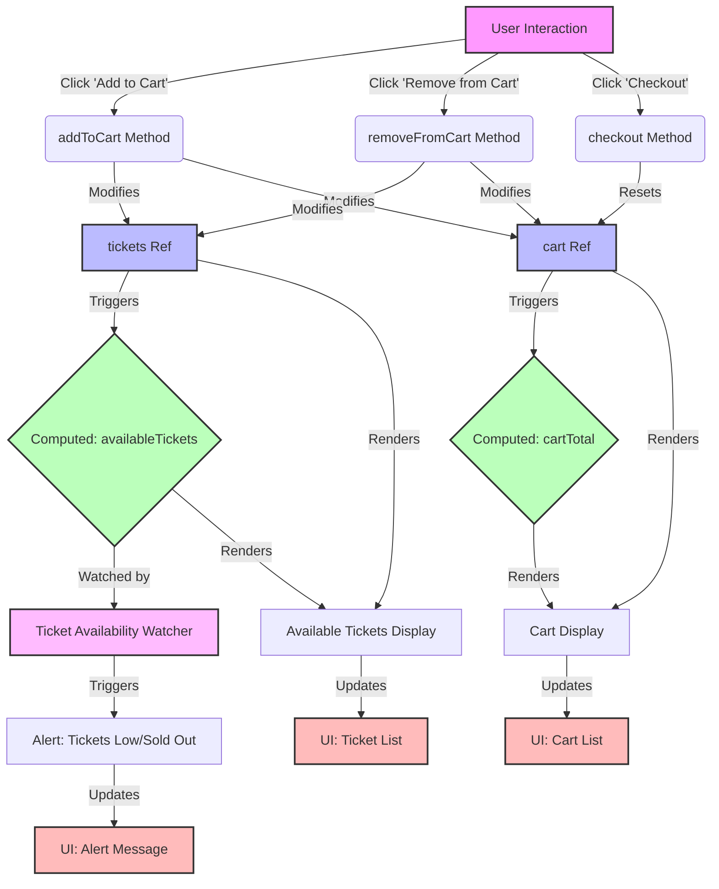

# Class Diagram


# Flow


# Code
```js
<!-- App.vue -->
<template>
  <div id="app">
    <h1>{{ concert.name }} Ticket Booking</h1>
    <div v-if="tickets.length > 0">
      <h2>Available Tickets: {{ availableTickets }}</h2>
      <div v-for="ticket in tickets" :key="ticket.id">
        <h3>{{ ticket.type }}</h3>
        <p>Price: ${{ ticket.price }}</p>
        <button @click="addToCart(ticket)" :disabled="ticket.quantity === 0">
          Add to Cart ({{ ticket.quantity }} left)
        </button>
      </div>
    </div>
    <div v-else>
      <p>Sorry, no tickets available.</p>
    </div>
    <div v-if="cart.length > 0">
      <h2>Your Cart</h2>
      <div v-for="(item, index) in cart" :key="index">
        <p>{{ item.type }} - ${{ item.price }}</p>
        <button @click="removeFromCart(index)">Remove</button>
      </div>
      <h3>Total: ${{ cartTotal }}</h3>
      <button @click="checkout">Checkout</button>
    </div>
  </div>
</template>

<script>
import { ref, computed, watch } from 'vue'

export default {
  name: 'App',
  setup() {
    const concert = ref({
      id: 1,
      name: 'Rock Festival 2024',
      date: '2024-07-15',
    })

    const tickets = ref([
      { id: 1, type: 'General Admission', price: 50, quantity: 100 },
      { id: 2, type: 'VIP', price: 150, quantity: 20 },
      { id: 3, type: 'Backstage Pass', price: 250, quantity: 5 },
    ])

    const cart = ref([])

    const availableTickets = computed(() => {
      return tickets.value.reduce((total, ticket) => total + ticket.quantity, 0)
    })

    const cartTotal = computed(() => {
      return cart.value.reduce((total, item) => total + item.price, 0)
    })

    function addToCart(ticket) {
      if (ticket.quantity > 0) {
        cart.value.push({ ...ticket })
        ticket.quantity--
      }
    }

    function removeFromCart(index) {
      const removedTicket = cart.value.splice(index, 1)[0]
      const originalTicket = tickets.value.find(t => t.id === removedTicket.id)
      originalTicket.quantity++
    }

    function checkout() {
      alert(`Thank you for your purchase! Total: $${cartTotal.value}`)
      cart.value = []
    }

    watch(availableTickets, (newValue) => {
      if (newValue === 0) {
        alert('All tickets have been sold out!')
      } else if (newValue <= 10) {
        alert('Only a few tickets left! Hurry up!')
      }
    })

    return {
      concert,
      tickets,
      cart,
      availableTickets,
      cartTotal,
      addToCart,
      removeFromCart,
      checkout
    }
  }
}
</script>

<style scoped>
#app {
  font-family: Arial, sans-serif;
  max-width: 800px;
  margin: 0 auto;
  padding: 20px;
}

button {
  margin: 5px;
  padding: 5px 10px;
  cursor: pointer;
}

button:disabled {
  cursor: not-allowed;
  opacity: 0.5;
}
</style>

```