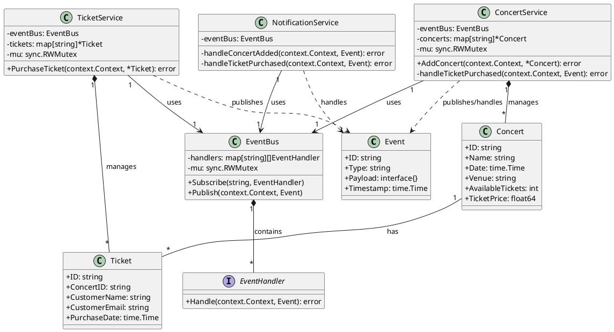
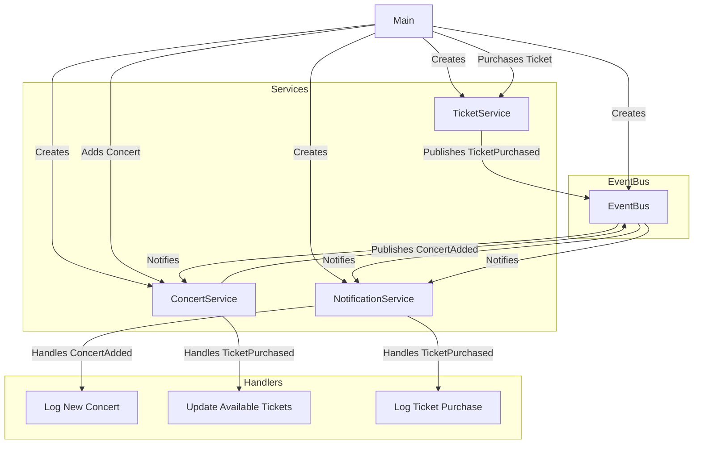

# Event Bus
## Diagram

## Flow


## Code
```go
package main

import (
    "context"
    "encoding/json"
    "fmt"
    "log"
    "sync"
    "time"

    "github.com/google/uuid"
)

// Event represents a domain event in the system
type Event struct {
    ID        string
    Type      string
    Payload   interface{}
    Timestamp time.Time
}

// EventHandler is a function that processes an event
type EventHandler func(context.Context, Event) error

// EventBus manages subscriptions and publishing of events
type EventBus struct {
    handlers map[string][]EventHandler
    mu       sync.RWMutex
}

// NewEventBus creates a new EventBus
func NewEventBus() *EventBus {
    return &EventBus{
        handlers: make(map[string][]EventHandler),
    }
}

// Subscribe adds a handler for a specific event type
func (eb *EventBus) Subscribe(eventType string, handler EventHandler) {
    eb.mu.Lock()
    defer eb.mu.Unlock()
    eb.handlers[eventType] = append(eb.handlers[eventType], handler)
}

// Publish sends an event to all subscribed handlers
func (eb *EventBus) Publish(ctx context.Context, event Event) {
    eb.mu.RLock()
    defer eb.mu.RUnlock()
    for _, handler := range eb.handlers[event.Type] {
        go func(h EventHandler) {
            if err := h(ctx, event); err != nil {
                log.Printf("Error handling event %s: %v", event.ID, err)
            }
        }(handler)
    }
}

// Concert represents a concert in the system
type Concert struct {
    ID               string
    Name             string
    Date             time.Time
    Venue            string
    AvailableTickets int
    TicketPrice      float64
}

// Ticket represents a concert ticket
type Ticket struct {
    ID          string
    ConcertID   string
    CustomerName string
    CustomerEmail string
    PurchaseDate time.Time
}

// ConcertService manages concert-related operations
type ConcertService struct {
    eventBus *EventBus
    concerts map[string]*Concert
    mu       sync.RWMutex
}

// NewConcertService creates a new ConcertService
func NewConcertService(eb *EventBus) *ConcertService {
    cs := &ConcertService{
        eventBus: eb,
        concerts: make(map[string]*Concert),
    }
    eb.Subscribe("TicketPurchased", cs.handleTicketPurchased)
    return cs
}

// AddConcert adds a new concert and publishes an event
func (cs *ConcertService) AddConcert(ctx context.Context, concert *Concert) error {
    cs.mu.Lock()
    defer cs.mu.Unlock()
    concert.ID = uuid.New().String()
    cs.concerts[concert.ID] = concert
    
    cs.eventBus.Publish(ctx, Event{
        ID:        uuid.New().String(),
        Type:      "ConcertAdded",
        Payload:   concert,
        Timestamp: time.Now(),
    })
    return nil
}

func (cs *ConcertService) handleTicketPurchased(ctx context.Context, event Event) error {
    ticket := event.Payload.(*Ticket)
    cs.mu.Lock()
    defer cs.mu.Unlock()
    if concert, ok := cs.concerts[ticket.ConcertID]; ok {
        concert.AvailableTickets--
    }
    return nil
}

// TicketService manages ticket-related operations
type TicketService struct {
    eventBus *EventBus
    tickets  map[string]*Ticket
    mu       sync.RWMutex
}

// NewTicketService creates a new TicketService
func NewTicketService(eb *EventBus) *TicketService {
    return &TicketService{
        eventBus: eb,
        tickets:  make(map[string]*Ticket),
    }
}

// PurchaseTicket creates a new ticket and publishes an event
func (ts *TicketService) PurchaseTicket(ctx context.Context, ticket *Ticket) error {
    ts.mu.Lock()
    defer ts.mu.Unlock()
    ticket.ID = uuid.New().String()
    ticket.PurchaseDate = time.Now()
    ts.tickets[ticket.ID] = ticket
    
    ts.eventBus.Publish(ctx, Event{
        ID:        uuid.New().String(),
        Type:      "TicketPurchased",
        Payload:   ticket,
        Timestamp: time.Now(),
    })
    return nil
}

// NotificationService sends notifications based on events
type NotificationService struct {
    eventBus *EventBus
}

// NewNotificationService creates a new NotificationService
func NewNotificationService(eb *EventBus) *NotificationService {
    ns := &NotificationService{eventBus: eb}
    eb.Subscribe("ConcertAdded", ns.handleConcertAdded)
    eb.Subscribe("TicketPurchased", ns.handleTicketPurchased)
    return ns
}

func (ns *NotificationService) handleConcertAdded(ctx context.Context, event Event) error {
    concert := event.Payload.(*Concert)
    log.Printf("New concert added: %s on %s at %s", concert.Name, concert.Date, concert.Venue)
    // Here you would implement actual notification logic (e.g., sending emails)
    return nil
}

func (ns *NotificationService) handleTicketPurchased(ctx context.Context, event Event) error {
    ticket := event.Payload.(*Ticket)
    log.Printf("Ticket purchased: Concert ID %s for %s (%s)", ticket.ConcertID, ticket.CustomerName, ticket.CustomerEmail)
    // Here you would implement actual notification logic (e.g., sending confirmation emails)
    return nil
}

// Simulated database operation
func simulateDBOperation() {
    time.Sleep(time.Millisecond * 100)
}

func main() {
    ctx := context.Background()
    eventBus := NewEventBus()

    concertService := NewConcertService(eventBus)
    ticketService := NewTicketService(eventBus)
    NewNotificationService(eventBus)

    // Add a concert
    concert := &Concert{
        Name:             "Rock Festival 2023",
        Date:             time.Now().AddDate(0, 1, 0),
        Venue:            "Central Park",
        AvailableTickets: 1000,
        TicketPrice:      99.99,
    }
    if err := concertService.AddConcert(ctx, concert); err != nil {
        log.Fatalf("Failed to add concert: %v", err)
    }
    simulateDBOperation()

    // Purchase a ticket
    ticket := &Ticket{
        ConcertID:    concert.ID,
        CustomerName: "John Doe",
        CustomerEmail: "john@example.com",
    }
    if err := ticketService.PurchaseTicket(ctx, ticket); err != nil {
        log.Fatalf("Failed to purchase ticket: %v", err)
    }
    simulateDBOperation()

    // Wait for a moment to allow events to be processed
    time.Sleep(time.Second)

    // Print final state
    fmt.Printf("Concert %s has %d tickets remaining\n", concert.ID, concertService.concerts[concert.ID].AvailableTickets)
}

```
