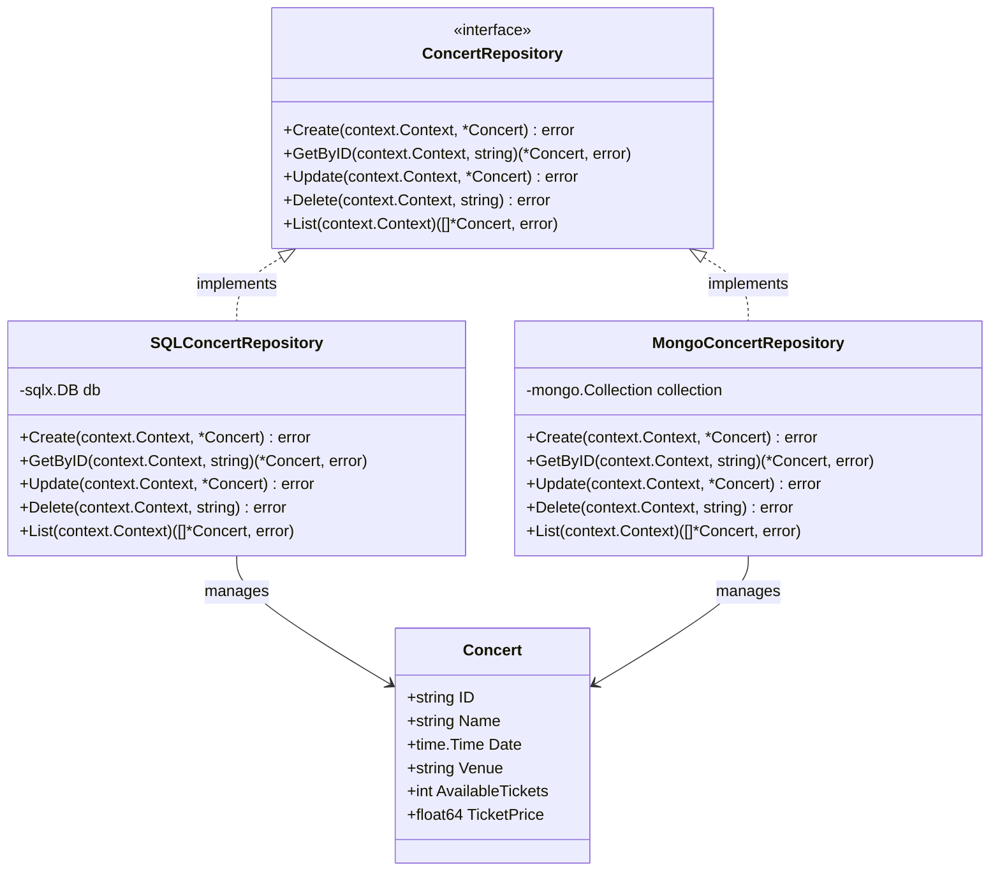
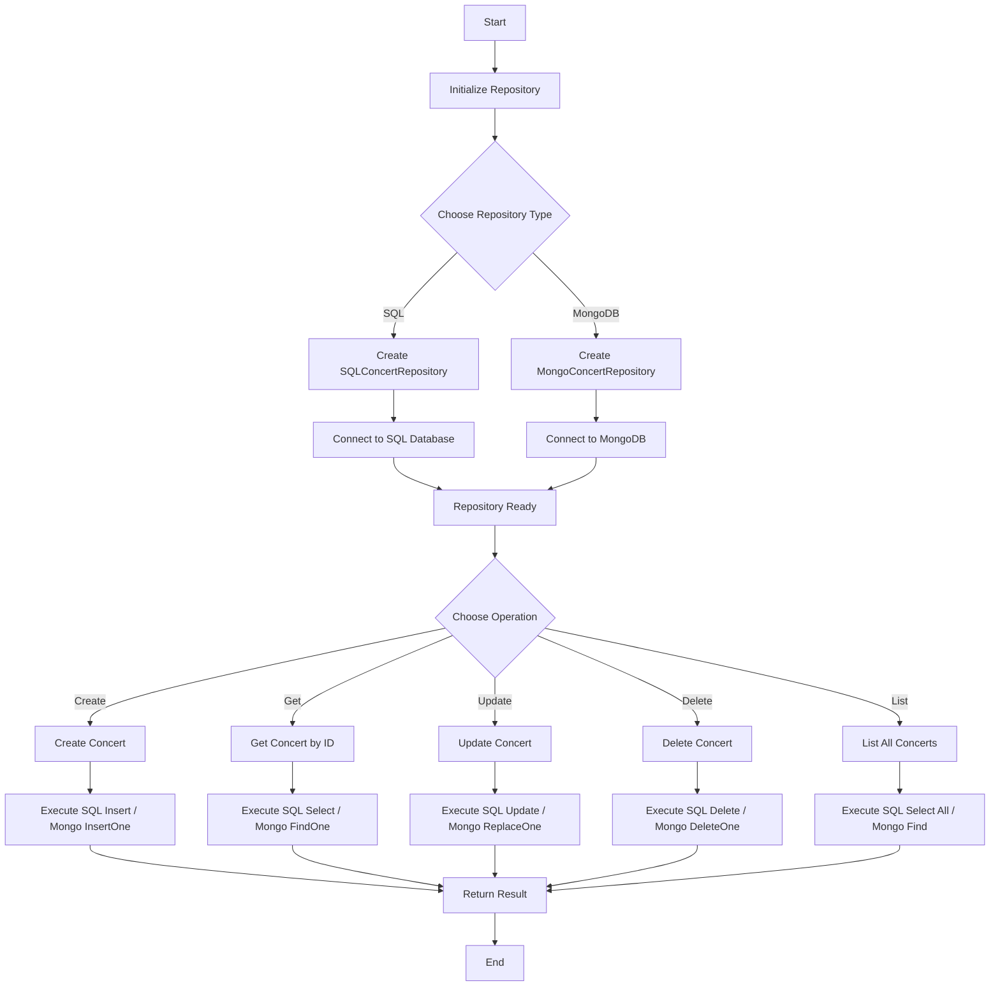

# Repository

## Class Diagram

## Flow


## Code
```go
package repository

import (
    "context"
    "database/sql"
    "errors"
    "time"

    "github.com/jmoiron/sqlx"
    "go.mongodb.org/mongo-driver/mongo"
    "go.mongodb.org/mongo-driver/bson"
    _ "github.com/lib/pq"
    _ "github.com/mattn/go-sqlite3"
)

// Concert represents a concert entity
type Concert struct {
    ID               string    `db:"id" bson:"_id"`
    Name             string    `db:"name" bson:"name"`
    Date             time.Time `db:"date" bson:"date"`
    Venue            string    `db:"venue" bson:"venue"`
    AvailableTickets int       `db:"available_tickets" bson:"available_tickets"`
    TicketPrice      float64   `db:"ticket_price" bson:"ticket_price"`
}

// ConcertRepository defines the interface for concert operations
type ConcertRepository interface {
    Create(ctx context.Context, concert *Concert) error
    GetByID(ctx context.Context, id string) (*Concert, error)
    Update(ctx context.Context, concert *Concert) error
    Delete(ctx context.Context, id string) error
    List(ctx context.Context) ([]*Concert, error)
}

// SQLConcertRepository implements ConcertRepository for SQL databases
type SQLConcertRepository struct {
    db *sqlx.DB
}

// NewSQLConcertRepository creates a new SQLConcertRepository
func NewSQLConcertRepository(driverName, dataSourceName string) (*SQLConcertRepository, error) {
    db, err := sqlx.Connect(driverName, dataSourceName)
    if err != nil {
        return nil, err
    }
    return &SQLConcertRepository{db: db}, nil
}

func (r *SQLConcertRepository) Create(ctx context.Context, concert *Concert) error {
    query := `INSERT INTO concerts (id, name, date, venue, available_tickets, ticket_price) 
              VALUES (:id, :name, :date, :venue, :available_tickets, :ticket_price)`
    _, err := r.db.NamedExecContext(ctx, query, concert)
    return err
}

func (r *SQLConcertRepository) GetByID(ctx context.Context, id string) (*Concert, error) {
    var concert Concert
    err := r.db.GetContext(ctx, &concert, "SELECT * FROM concerts WHERE id = $1", id)
    if err == sql.ErrNoRows {
        return nil, errors.New("concert not found")
    }
    return &concert, err
}

func (r *SQLConcertRepository) Update(ctx context.Context, concert *Concert) error {
    query := `UPDATE concerts SET name = :name, date = :date, venue = :venue, 
              available_tickets = :available_tickets, ticket_price = :ticket_price 
              WHERE id = :id`
    _, err := r.db.NamedExecContext(ctx, query, concert)
    return err
}

func (r *SQLConcertRepository) Delete(ctx context.Context, id string) error {
    _, err := r.db.ExecContext(ctx, "DELETE FROM concerts WHERE id = $1", id)
    return err
}

func (r *SQLConcertRepository) List(ctx context.Context) ([]*Concert, error) {
    var concerts []*Concert
    err := r.db.SelectContext(ctx, &concerts, "SELECT * FROM concerts")
    return concerts, err
}

// MongoConcertRepository implements ConcertRepository for MongoDB
type MongoConcertRepository struct {
    collection *mongo.Collection
}

// NewMongoConcertRepository creates a new MongoConcertRepository
func NewMongoConcertRepository(client *mongo.Client, dbName, collectionName string) *MongoConcertRepository {
    collection := client.Database(dbName).Collection(collectionName)
    return &MongoConcertRepository{collection: collection}
}

func (r *MongoConcertRepository) Create(ctx context.Context, concert *Concert) error {
    _, err := r.collection.InsertOne(ctx, concert)
    return err
}

func (r *MongoConcertRepository) GetByID(ctx context.Context, id string) (*Concert, error) {
    var concert Concert
    err := r.collection.FindOne(ctx, bson.M{"_id": id}).Decode(&concert)
    if err == mongo.ErrNoDocuments {
        return nil, errors.New("concert not found")
    }
    return &concert, err
}

func (r *MongoConcertRepository) Update(ctx context.Context, concert *Concert) error {
    _, err := r.collection.ReplaceOne(ctx, bson.M{"_id": concert.ID}, concert)
    return err
}

func (r *MongoConcertRepository) Delete(ctx context.Context, id string) error {
    _, err := r.collection.DeleteOne(ctx, bson.M{"_id": id})
    return err
}

func (r *MongoConcertRepository) List(ctx context.Context) ([]*Concert, error) {
    cursor, err := r.collection.Find(ctx, bson.M{})
    if err != nil {
        return nil, err
    }
    defer cursor.Close(ctx)

    var concerts []*Concert
    err = cursor.All(ctx, &concerts)
    return concerts, err
}

// Usage example
func main() {
    // PostgreSQL example
    postgresRepo, err := NewSQLConcertRepository("postgres", "host=localhost dbname=concerts user=user password=pass")
    if err != nil {
        panic(err)
    }

    // SQLite example
    sqliteRepo, err := NewSQLConcertRepository("sqlite3", "concerts.db")
    if err != nil {
        panic(err)
    }

    // MongoDB example
    mongoClient, err := mongo.Connect(context.Background(), options.Client().ApplyURI("mongodb://localhost:27017"))
    if err != nil {
        panic(err)
    }
    mongoRepo := NewMongoConcertRepository(mongoClient, "concerts_db", "concerts")

    // Use the repositories...
    ctx := context.Background()
    concert := &Concert{
        ID:               "1",
        Name:             "Rock Festival 2023",
        Date:             time.Now().AddDate(0, 1, 0),
        Venue:            "Central Park",
        AvailableTickets: 1000,
        TicketPrice:      99.99,
    }

    // Create concert using PostgreSQL repository
    err = postgresRepo.Create(ctx, concert)
    if err != nil {
        panic(err)
    }

    // Retrieve concert using SQLite repository
    retrievedConcert, err := sqliteRepo.GetByID(ctx, "1")
    if err != nil {
        panic(err)
    }
    fmt.Printf("Retrieved concert: %+v\n", retrievedConcert)

    // List concerts using MongoDB repository
    concerts, err := mongoRepo.List(ctx)
    if err != nil {
        panic(err)
    }
    fmt.Printf("All concerts: %+v\n", concerts)
}

```