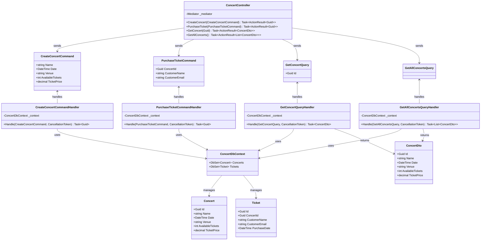
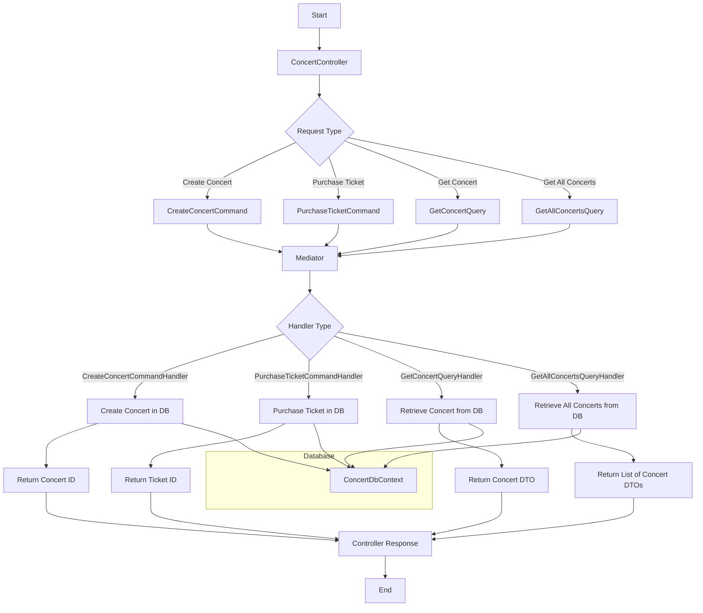

# CQRS

## Class diagram


## Flow


## Code
```csharp
using System;
using System.Collections.Generic;
using System.Threading.Tasks;
using MediatR;
using Microsoft.EntityFrameworkCore;

// Domain Models
public class Concert
{
    public Guid Id { get; set; }
    public string Name { get; set; }
    public DateTime Date { get; set; }
    public string Venue { get; set; }
    public int AvailableTickets { get; set; }
    public decimal TicketPrice { get; set; }
}

public class Ticket
{
    public Guid Id { get; set; }
    public Guid ConcertId { get; set; }
    public string CustomerName { get; set; }
    public string CustomerEmail { get; set; }
    public DateTime PurchaseDate { get; set; }
}

// Command Models
public class CreateConcertCommand : IRequest<Guid>
{
    public string Name { get; set; }
    public DateTime Date { get; set; }
    public string Venue { get; set; }
    public int AvailableTickets { get; set; }
    public decimal TicketPrice { get; set; }
}

public class PurchaseTicketCommand : IRequest<Guid>
{
    public Guid ConcertId { get; set; }
    public string CustomerName { get; set; }
    public string CustomerEmail { get; set; }
}

// Query Models
public class GetConcertQuery : IRequest<ConcertDto>
{
    public Guid Id { get; set; }
}

public class GetAllConcertsQuery : IRequest<List<ConcertDto>>
{
}

public class ConcertDto
{
    public Guid Id { get; set; }
    public string Name { get; set; }
    public DateTime Date { get; set; }
    public string Venue { get; set; }
    public int AvailableTickets { get; set; }
    public decimal TicketPrice { get; set; }
}

// Command Handlers
public class CreateConcertCommandHandler : IRequestHandler<CreateConcertCommand, Guid>
{
    private readonly ConcertDbContext _context;

    public CreateConcertCommandHandler(ConcertDbContext context)
    {
        _context = context;
    }

    public async Task<Guid> Handle(CreateConcertCommand request, CancellationToken cancellationToken)
    {
        var concert = new Concert
        {
            Id = Guid.NewGuid(),
            Name = request.Name,
            Date = request.Date,
            Venue = request.Venue,
            AvailableTickets = request.AvailableTickets,
            TicketPrice = request.TicketPrice
        };

        _context.Concerts.Add(concert);
        await _context.SaveChangesAsync(cancellationToken);

        return concert.Id;
    }
}

public class PurchaseTicketCommandHandler : IRequestHandler<PurchaseTicketCommand, Guid>
{
    private readonly ConcertDbContext _context;

    public PurchaseTicketCommandHandler(ConcertDbContext context)
    {
        _context = context;
    }

    public async Task<Guid> Handle(PurchaseTicketCommand request, CancellationToken cancellationToken)
    {
        var concert = await _context.Concerts.FindAsync(new object[] { request.ConcertId }, cancellationToken);

        if (concert == null || concert.AvailableTickets <= 0)
            throw new Exception("Concert not found or no tickets available");

        var ticket = new Ticket
        {
            Id = Guid.NewGuid(),
            ConcertId = request.ConcertId,
            CustomerName = request.CustomerName,
            CustomerEmail = request.CustomerEmail,
            PurchaseDate = DateTime.UtcNow
        };

        concert.AvailableTickets--;

        _context.Tickets.Add(ticket);
        await _context.SaveChangesAsync(cancellationToken);

        return ticket.Id;
    }
}

// Query Handlers
public class GetConcertQueryHandler : IRequestHandler<GetConcertQuery, ConcertDto>
{
    private readonly ConcertDbContext _context;

    public GetConcertQueryHandler(ConcertDbContext context)
    {
        _context = context;
    }

    public async Task<ConcertDto> Handle(GetConcertQuery request, CancellationToken cancellationToken)
    {
        var concert = await _context.Concerts.FindAsync(new object[] { request.Id }, cancellationToken);

        if (concert == null)
            return null;

        return new ConcertDto
        {
            Id = concert.Id,
            Name = concert.Name,
            Date = concert.Date,
            Venue = concert.Venue,
            AvailableTickets = concert.AvailableTickets,
            TicketPrice = concert.TicketPrice
        };
    }
}

public class GetAllConcertsQueryHandler : IRequestHandler<GetAllConcertsQuery, List<ConcertDto>>
{
    private readonly ConcertDbContext _context;

    public GetAllConcertsQueryHandler(ConcertDbContext context)
    {
        _context = context;
    }

    public async Task<List<ConcertDto>> Handle(GetAllConcertsQuery request, CancellationToken cancellationToken)
    {
        return await _context.Concerts
            .Select(c => new ConcertDto
            {
                Id = c.Id,
                Name = c.Name,
                Date = c.Date,
                Venue = c.Venue,
                AvailableTickets = c.AvailableTickets,
                TicketPrice = c.TicketPrice
            })
            .ToListAsync(cancellationToken);
    }
}

// Database Context
public class ConcertDbContext : DbContext
{
    public ConcertDbContext(DbContextOptions<ConcertDbContext> options) : base(options) { }

    public DbSet<Concert> Concerts { get; set; }
    public DbSet<Ticket> Tickets { get; set; }
}

// Example usage in a controller
public class ConcertController : ControllerBase
{
    private readonly IMediator _mediator;

    public ConcertController(IMediator mediator)
    {
        _mediator = mediator;
    }

    [HttpPost]
    public async Task<ActionResult<Guid>> CreateConcert([FromBody] CreateConcertCommand command)
    {
        var concertId = await _mediator.Send(command);
        return Ok(concertId);
    }

    [HttpPost("purchase")]
    public async Task<ActionResult<Guid>> PurchaseTicket([FromBody] PurchaseTicketCommand command)
    {
        var ticketId = await _mediator.Send(command);
        return Ok(ticketId);
    }

    [HttpGet("{id}")]
    public async Task<ActionResult<ConcertDto>> GetConcert(Guid id)
    {
        var concert = await _mediator.Send(new GetConcertQuery { Id = id });
        if (concert == null)
            return NotFound();
        return Ok(concert);
    }

    [HttpGet]
    public async Task<ActionResult<List<ConcertDto>>> GetAllConcerts()
    {
        var concerts = await _mediator.Send(new GetAllConcertsQuery());
        return Ok(concerts);
    }
}

```