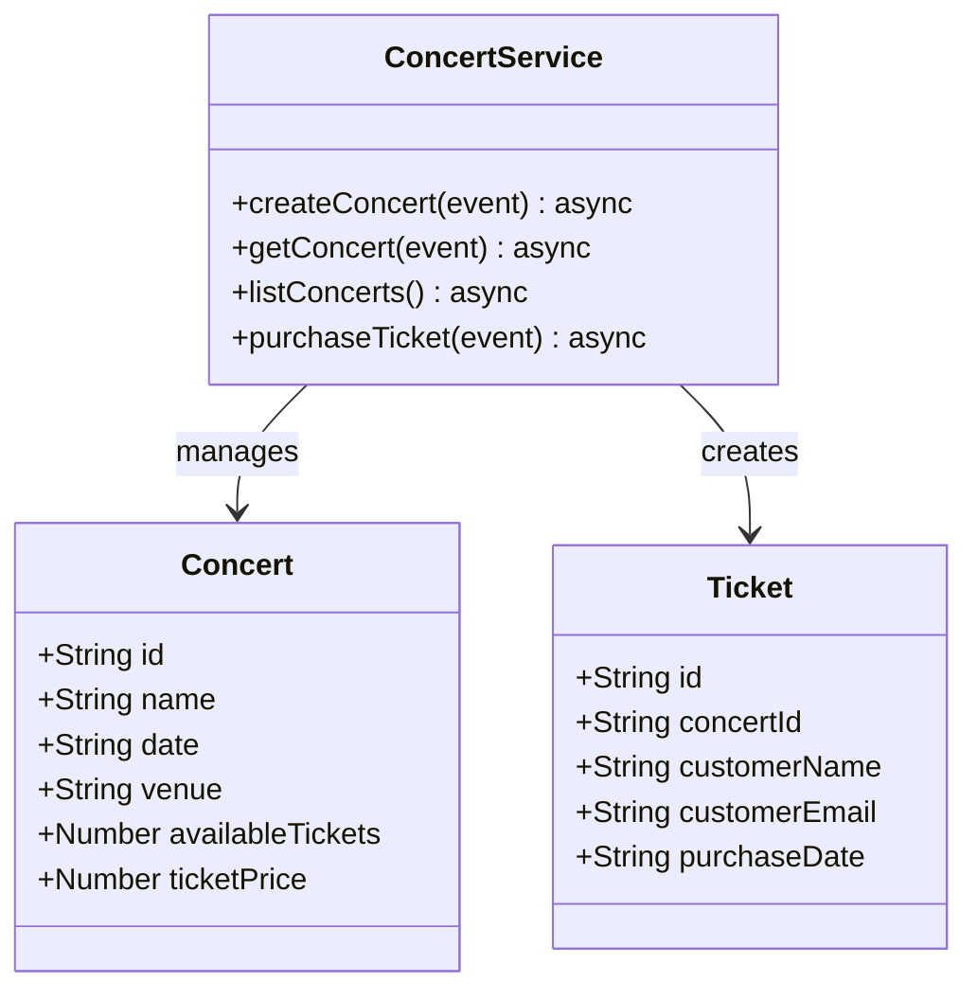
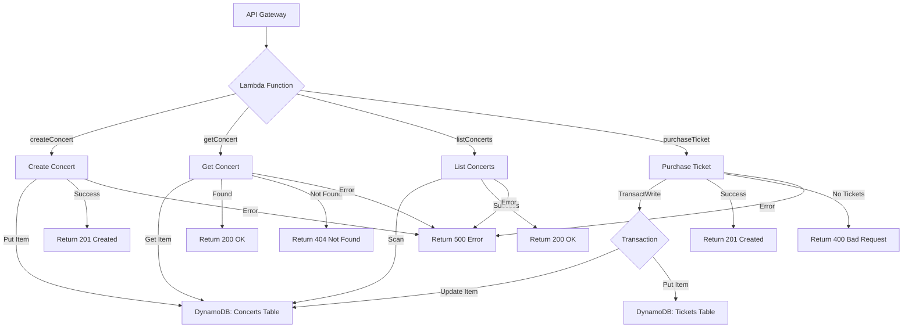

# Serverless

## Class diagrams


## Flow

## Code
```javascript
// concert-service.js
const AWS = require('aws-sdk');
const dynamoDB = new AWS.DynamoDB.DocumentClient();
const { v4: uuidv4 } = require('uuid');

const CONCERTS_TABLE = process.env.CONCERTS_TABLE;
const TICKETS_TABLE = process.env.TICKETS_TABLE;

exports.createConcert = async (event) => {
    const { name, date, venue, availableTickets, ticketPrice } = JSON.parse(event.body);
    const concertId = uuidv4();

    const params = {
        TableName: CONCERTS_TABLE,
        Item: {
            id: concertId,
            name,
            date,
            venue,
            availableTickets,
            ticketPrice
        }
    };

    try {
        await dynamoDB.put(params).promise();
        return {
            statusCode: 201,
            body: JSON.stringify({ id: concertId })
        };
    } catch (error) {
        console.error(error);
        return {
            statusCode: 500,
            body: JSON.stringify({ error: 'Could not create concert' })
        };
    }
};

exports.getConcert = async (event) => {
    const { id } = event.pathParameters;

    const params = {
        TableName: CONCERTS_TABLE,
        Key: { id }
    };

    try {
        const result = await dynamoDB.get(params).promise();
        if (result.Item) {
            return {
                statusCode: 200,
                body: JSON.stringify(result.Item)
            };
        } else {
            return {
                statusCode: 404,
                body: JSON.stringify({ error: 'Concert not found' })
            };
        }
    } catch (error) {
        console.error(error);
        return {
            statusCode: 500,
            body: JSON.stringify({ error: 'Could not retrieve concert' })
        };
    }
};

exports.listConcerts = async () => {
    const params = {
        TableName: CONCERTS_TABLE
    };

    try {
        const result = await dynamoDB.scan(params).promise();
        return {
            statusCode: 200,
            body: JSON.stringify(result.Items)
        };
    } catch (error) {
        console.error(error);
        return {
            statusCode: 500,
            body: JSON.stringify({ error: 'Could not retrieve concerts' })
        };
    }
};

exports.purchaseTicket = async (event) => {
    const { concertId, customerName, customerEmail } = JSON.parse(event.body);
    const ticketId = uuidv4();

    // Start a transaction
    const transactionParams = {
        TransactItems: [
            {
                Update: {
                    TableName: CONCERTS_TABLE,
                    Key: { id: concertId },
                    UpdateExpression: 'SET availableTickets = availableTickets - :dec',
                    ConditionExpression: 'availableTickets > :zero',
                    ExpressionAttributeValues: {
                        ':dec': 1,
                        ':zero': 0
                    }
                }
            },
            {
                Put: {
                    TableName: TICKETS_TABLE,
                    Item: {
                        id: ticketId,
                        concertId,
                        customerName,
                        customerEmail,
                        purchaseDate: new Date().toISOString()
                    }
                }
            }
        ]
    };

    try {
        await dynamoDB.transactWrite(transactionParams).promise();
        return {
            statusCode: 201,
            body: JSON.stringify({ id: ticketId })
        };
    } catch (error) {
        console.error(error);
        if (error.code === 'TransactionCanceledException') {
            return {
                statusCode: 400,
                body: JSON.stringify({ error: 'No tickets available' })
            };
        }
        return {
            statusCode: 500,
            body: JSON.stringify({ error: 'Could not purchase ticket' })
        };
    }
};

// serverless.yml
service: concert-ticket-system

provider:
  name: aws
  runtime: nodejs14.x
  stage: ${opt:stage, 'dev'}
  region: ${opt:region, 'us-east-1'}
  environment:
    CONCERTS_TABLE: ${self:service}-concerts-${opt:stage, self:provider.stage}
    TICKETS_TABLE: ${self:service}-tickets-${opt:stage, self:provider.stage}
  iamRoleStatements:
    - Effect: Allow
      Action:
        - dynamodb:PutItem
        - dynamodb:GetItem
        - dynamodb:Scan
        - dynamodb:UpdateItem
        - dynamodb:TransactWriteItems
      Resource: 
        - "arn:aws:dynamodb:${opt:region, self:provider.region}:*:table/${self:provider.environment.CONCERTS_TABLE}"
        - "arn:aws:dynamodb:${opt:region, self:provider.region}:*:table/${self:provider.environment.TICKETS_TABLE}"

functions:
  createConcert:
    handler: concert-service.createConcert
    events:
      - http:
          path: concerts
          method: post
  getConcert:
    handler: concert-service.getConcert
    events:
      - http:
          path: concerts/{id}
          method: get
  listConcerts:
    handler: concert-service.listConcerts
    events:
      - http:
          path: concerts
          method: get
  purchaseTicket:
    handler: concert-service.purchaseTicket
    events:
      - http:
          path: tickets
          method: post

resources:
  Resources:
    ConcertsTable:
      Type: AWS::DynamoDB::Table
      Properties:
        TableName: ${self:provider.environment.CONCERTS_TABLE}
        AttributeDefinitions:
          - AttributeName: id
            AttributeType: S
        KeySchema:
          - AttributeName: id
            KeyType: HASH
        BillingMode: PAY_PER_REQUEST
    TicketsTable:
      Type: AWS::DynamoDB::Table
      Properties:
        TableName: ${self:provider.environment.TICKETS_TABLE}
        AttributeDefinitions:
          - AttributeName: id
            AttributeType: S
        KeySchema:
          - AttributeName: id
            KeyType: HASH
        BillingMode: PAY_PER_REQUEST

```