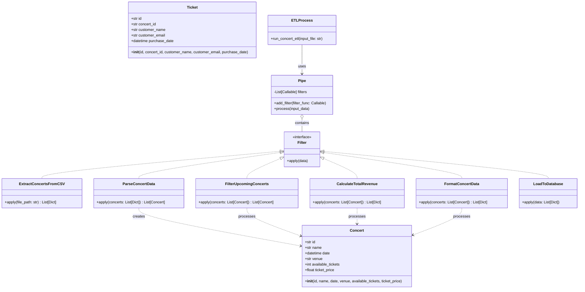
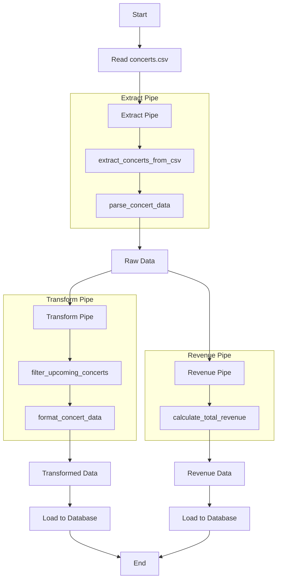

# Pipe and Filter
## Class Diagram

## Flow


## Code
```python
import csv
from datetime import datetime
from typing import List, Dict, Callable

# Data Models
class Concert:
    def __init__(self, id: str, name: str, date: datetime, venue: str, available_tickets: int, ticket_price: float):
        self.id = id
        self.name = name
        self.date = date
        self.venue = venue
        self.available_tickets = available_tickets
        self.ticket_price = ticket_price

class Ticket:
    def __init__(self, id: str, concert_id: str, customer_name: str, customer_email: str, purchase_date: datetime):
        self.id = id
        self.concert_id = concert_id
        self.customer_name = customer_name
        self.customer_email = customer_email
        self.purchase_date = purchase_date

# Filters
def extract_concerts_from_csv(file_path: str) -> List[Dict]:
    concerts = []
    with open(file_path, 'r') as file:
        reader = csv.DictReader(file)
        for row in reader:
            concerts.append(row)
    return concerts

def parse_concert_data(concerts: List[Dict]) -> List[Concert]:
    return [
        Concert(
            id=concert['id'],
            name=concert['name'],
            date=datetime.strptime(concert['date'], '%Y-%m-%d %H:%M:%S'),
            venue=concert['venue'],
            available_tickets=int(concert['available_tickets']),
            ticket_price=float(concert['ticket_price'])
        )
        for concert in concerts
    ]

def filter_upcoming_concerts(concerts: List[Concert]) -> List[Concert]:
    now = datetime.now()
    return [concert for concert in concerts if concert.date > now]

def calculate_total_revenue(concerts: List[Concert]) -> List[Dict]:
    return [
        {
            'id': concert.id,
            'name': concert.name,
            'total_revenue': concert.available_tickets * concert.ticket_price
        }
        for concert in concerts
    ]

def format_concert_data(concerts: List[Concert]) -> List[Dict]:
    return [
        {
            'id': concert.id,
            'name': concert.name,
            'date': concert.date.strftime('%Y-%m-%d %H:%M:%S'),
            'venue': concert.venue,
            'available_tickets': concert.available_tickets,
            'ticket_price': f'${concert.ticket_price:.2f}'
        }
        for concert in concerts
    ]

def load_to_database(data: List[Dict]):
    # Simulating database load
    print(f"Loading {len(data)} records to database...")
    for record in data:
        print(f"Inserting: {record}")
    print("Load complete.")

# Pipe
class Pipe:
    def __init__(self):
        self.filters: List[Callable] = []

    def add_filter(self, filter_func: Callable):
        self.filters.append(filter_func)

    def process(self, input_data):
        result = input_data
        for filter_func in self.filters:
            result = filter_func(result)
        return result

# ETL Process
def run_concert_etl(input_file: str):
    # Create pipes
    extract_pipe = Pipe()
    extract_pipe.add_filter(extract_concerts_from_csv)
    extract_pipe.add_filter(parse_concert_data)

    transform_pipe = Pipe()
    transform_pipe.add_filter(filter_upcoming_concerts)
    transform_pipe.add_filter(format_concert_data)

    revenue_pipe = Pipe()
    revenue_pipe.add_filter(calculate_total_revenue)

    # Run ETL
    raw_data = extract_pipe.process(input_file)
    
    transformed_data = transform_pipe.process(raw_data)
    load_to_database(transformed_data)

    revenue_data = revenue_pipe.process(raw_data)
    load_to_database(revenue_data)

# Usage
if __name__ == "__main__":
    run_concert_etl('concerts.csv')

```