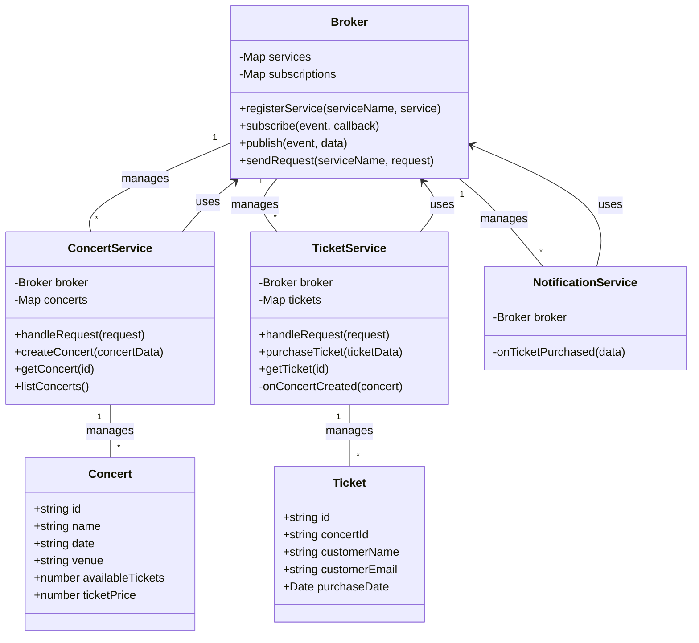
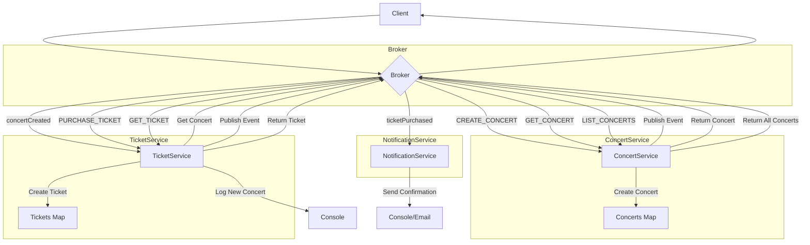

# Broker
## Class Diagram

## Flow

## Code
```javascript
// Broker.js
class Broker {
    constructor() {
        this.services = {};
        this.subscriptions = {};
    }

    registerService(serviceName, service) {
        this.services[serviceName] = service;
    }

    subscribe(event, callback) {
        if (!this.subscriptions[event]) {
            this.subscriptions[event] = [];
        }
        this.subscriptions[event].push(callback);
    }

    publish(event, data) {
        if (this.subscriptions[event]) {
            this.subscriptions[event].forEach(callback => callback(data));
        }
    }

    sendRequest(serviceName, request) {
        if (this.services[serviceName]) {
            return this.services[serviceName].handleRequest(request);
        }
        throw new Error(`Service ${serviceName} not found`);
    }
}

// ConcertService.js
class ConcertService {
    constructor(broker) {
        this.broker = broker;
        this.concerts = new Map();
        broker.registerService('concert', this);
    }

    handleRequest(request) {
        switch (request.type) {
            case 'CREATE_CONCERT':
                return this.createConcert(request.data);
            case 'GET_CONCERT':
                return this.getConcert(request.data.id);
            case 'LIST_CONCERTS':
                return this.listConcerts();
            default:
                throw new Error(`Unknown request type: ${request.type}`);
        }
    }

    createConcert(concertData) {
        const id = Date.now().toString();
        const concert = { id, ...concertData };
        this.concerts.set(id, concert);
        this.broker.publish('concertCreated', concert);
        return concert;
    }

    getConcert(id) {
        return this.concerts.get(id);
    }

    listConcerts() {
        return Array.from(this.concerts.values());
    }
}

// TicketService.js
class TicketService {
    constructor(broker) {
        this.broker = broker;
        this.tickets = new Map();
        broker.registerService('ticket', this);
        broker.subscribe('concertCreated', this.onConcertCreated.bind(this));
    }

    handleRequest(request) {
        switch (request.type) {
            case 'PURCHASE_TICKET':
                return this.purchaseTicket(request.data);
            case 'GET_TICKET':
                return this.getTicket(request.data.id);
            default:
                throw new Error(`Unknown request type: ${request.type}`);
        }
    }

    purchaseTicket(ticketData) {
        const concert = this.broker.sendRequest('concert', { type: 'GET_CONCERT', data: { id: ticketData.concertId } });
        if (!concert) {
            throw new Error('Concert not found');
        }
        if (concert.availableTickets <= 0) {
            throw new Error('No tickets available');
        }

        const id = Date.now().toString();
        const ticket = { id, ...ticketData, purchaseDate: new Date() };
        this.tickets.set(id, ticket);

        // Update concert available tickets
        concert.availableTickets--;
        this.broker.publish('ticketPurchased', { ticket, concertId: concert.id });

        return ticket;
    }

    getTicket(id) {
        return this.tickets.get(id);
    }

    onConcertCreated(concert) {
        console.log(`New concert created: ${concert.name}. Tickets available: ${concert.availableTickets}`);
    }
}

// NotificationService.js
class NotificationService {
    constructor(broker) {
        this.broker = broker;
        broker.subscribe('ticketPurchased', this.onTicketPurchased.bind(this));
    }

    onTicketPurchased(data) {
        console.log(`Ticket purchased for concert ${data.concertId}. Sending confirmation email to ${data.ticket.customerEmail}`);
    }
}

// Usage
const broker = new Broker();
const concertService = new ConcertService(broker);
const ticketService = new TicketService(broker);
const notificationService = new NotificationService(broker);

// Create a concert
const concert = broker.sendRequest('concert', {
    type: 'CREATE_CONCERT',
    data: {
        name: 'Rock Festival 2023',
        date: '2023-08-15',
        venue: 'Central Park',
        availableTickets: 1000,
        ticketPrice: 99.99
    }
});

// Purchase a ticket
const ticket = broker.sendRequest('ticket', {
    type: 'PURCHASE_TICKET',
    data: {
        concertId: concert.id,
        customerName: 'John Doe',
        customerEmail: 'john@example.com'
    }
});

// List all concerts
const allConcerts = broker.sendRequest('concert', { type: 'LIST_CONCERTS' });
console.log('All concerts:', allConcerts);

// Get a specific ticket
const retrievedTicket = broker.sendRequest('ticket', { type: 'GET_TICKET', data: { id: ticket.id } });
console.log('Retrieved ticket:', retrievedTicket);

```