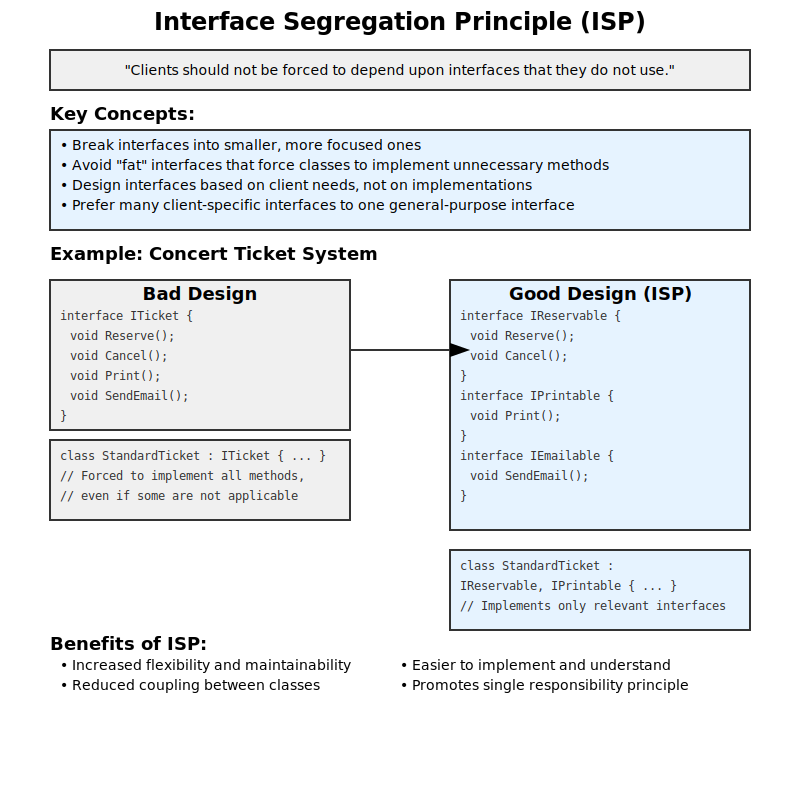
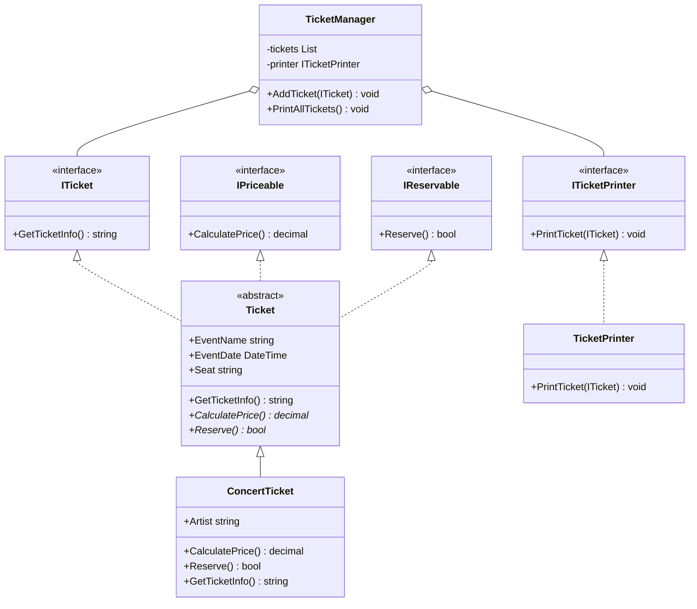

# Design Principles
## Table of Contents
- SOLID principles
- DRY (Don't Repeat Yourself)
- KISS (Keep It Simple, Stupid)
- Separation of Concerns

## SOLID Principles
- Single Responsibility Principle (SRP): A class should have one and only one reason to change.
- Open/Closed Principle: You should be able to extend a classes behavior without modifying
- Liskov Substitution Principle (LSP): Derived classes must be substitutable for their base classes.
- Interface Segregation Principle (ISP): Clients should not be forced to depend upon interfaces that they do not use.
- Dependency Inversion Principle (DIP): Depend on abstractions, not concretions.

### 1. Single Responsibility Principle (SRP)

Figure 1: (Slide 52) Single Responsibility Principle (SRP)


Example: Ticket class - responsible for holding ticket data

```csharp
using System;

// Ticket class - responsible for holding ticket data
public class Ticket
{
    public int Id { get; set; }
    public string EventName { get; set; }
    public DateTime EventDate { get; set; }
    public decimal Price { get; set; }
    public string SeatNumber { get; set; }
}

// TicketPriceCalculator - responsible for calculating ticket prices
public class TicketPriceCalculator
{
    public decimal CalculatePrice(Ticket ticket, bool isVIP)
    {
        decimal basePrice = ticket.Price;
        if (isVIP)
        {
            return basePrice * 1.5m;
        }
        return basePrice;
    }
}

// TicketReservationService - responsible for reserving tickets
public class TicketReservationService
{
    public bool ReserveTicket(Ticket ticket)
    {
        // Logic to reserve the ticket in the system
        Console.WriteLine($"Ticket reserved for {ticket.EventName} on {ticket.EventDate}");
        return true;
    }
}

// TicketPrintingService - responsible for printing tickets
public class TicketPrintingService
{
    public void PrintTicket(Ticket ticket)
    {
        Console.WriteLine($"Printing ticket:");
        Console.WriteLine($"Event: {ticket.EventName}");
        Console.WriteLine($"Date: {ticket.EventDate}");
        Console.WriteLine($"Seat: {ticket.SeatNumber}");
        Console.WriteLine($"Price: ${ticket.Price}");
    }
}

// Example usage
class Program
{
    static void Main(string[] args)
    {
        var ticket = new Ticket
        {
            Id = 1,
            EventName = "Rock Concert",
            EventDate = new DateTime(2023, 12, 31),
            Price = 100m,
            SeatNumber = "A1"
        };

        var priceCalculator = new TicketPriceCalculator();
        var reservationService = new TicketReservationService();
        var printingService = new TicketPrintingService();

        decimal vipPrice = priceCalculator.CalculatePrice(ticket, true);
        Console.WriteLine($"VIP Ticket Price: ${vipPrice}");

        if (reservationService.ReserveTicket(ticket))
        {
            printingService.PrintTicket(ticket);
        }
    }
}
```

### 2. Open / Closed Principle

Figure 2: (Slide 52) Open / Closed Principle Conceptual


Example: Ticket class - responsible for holding ticket data and price calculation logic.

```csharp
using System;
using System.Collections.Generic;
using System.Linq;

// Abstract base class for all types of concert tickets
public abstract class ConcertTicket
{
    public string ConcertName { get; protected set; }
    public decimal BasePrice { get; protected set; }

    public ConcertTicket(string concertName, decimal basePrice)
    {
        ConcertName = concertName;
        BasePrice = basePrice;
    }

    public abstract decimal CalculatePrice();
}

// Regular ticket implementation
public class RegularTicket : ConcertTicket
{
    public RegularTicket(string concertName, decimal basePrice) : base(concertName, basePrice) { }

    public override decimal CalculatePrice()
    {
        return BasePrice;
    }
}

// VIP ticket implementation
public class VIPTicket : ConcertTicket
{
    public decimal VIPSurcharge { get; private set; }

    public VIPTicket(string concertName, decimal basePrice, decimal vipSurcharge) : base(concertName, basePrice)
    {
        VIPSurcharge = vipSurcharge;
    }

    public override decimal CalculatePrice()
    {
        return BasePrice + VIPSurcharge;
    }
}

// Early bird ticket implementation
public class EarlyBirdTicket : ConcertTicket
{
    public decimal DiscountPercentage { get; private set; }

    public EarlyBirdTicket(string concertName, decimal basePrice, decimal discountPercentage) : base(concertName, basePrice)
    {
        DiscountPercentage = discountPercentage;
    }

    public override decimal CalculatePrice()
    {
        return BasePrice * (1 - DiscountPercentage);
    }
}

// Ticket processor that follows the Open-Closed Principle
public class TicketProcessor
{
    public decimal CalculateTotalPrice(IEnumerable<ConcertTicket> tickets)
    {
        return tickets.Sum(ticket => ticket.CalculatePrice());
    }
}

// Usage example
class Program
{
    static void Main(string[] args)
    {
        var tickets = new List<ConcertTicket>
        {
            new RegularTicket("Rock Festival", 100),
            new VIPTicket("Rock Festival", 100, 50),
            new EarlyBirdTicket("Jazz Night", 80, 0.2m)
        };

        var processor = new TicketProcessor();
        decimal totalPrice = processor.CalculateTotalPrice(tickets);

        Console.WriteLine($"Total price for all tickets: ${totalPrice}");

        // Adding a new type of ticket doesn't require changing the TicketProcessor
        // For example, we could add a StudentTicket class without modifying existing code
    }
}

```

### 3. Liskov's Substitution Principle (LSP)

Figure 3: (Slide 54) LSP - Conceptual


Example: Ticket class - LSP Conceptual

```csharp
using System;
using System.Collections.Generic;

public class ConcertTicket
{
    public virtual string GetTicketInfo() => "Standard Concert Ticket";
    public virtual decimal CalculatePrice() => 50m;
    public virtual void PrintTicket() => Console.WriteLine($"Printing: {GetTicketInfo()}");
}

public class VIPTicket : ConcertTicket
{
    public override string GetTicketInfo() => "VIP Concert Ticket";
    public override decimal CalculatePrice() => 100m;
    // VIPTicket adheres to LSP by not changing the behavior of PrintTicket
}

public class EarlyBirdTicket : ConcertTicket
{
    public override string GetTicketInfo() => "Early Bird Concert Ticket";
    public override decimal CalculatePrice() => 40m;
    // EarlyBirdTicket adheres to LSP by not changing the behavior of PrintTicket
}

// This class violates LSP
public class FreePassTicket : ConcertTicket
{
    public override string GetTicketInfo() => "Free Pass Ticket";
    public override decimal CalculatePrice() => 0m;
    public override void PrintTicket()
    {
        throw new InvalidOperationException("Free passes cannot be printed.");
    }
}

public class TicketManager
{
    public void ProcessTickets(List<ConcertTicket> tickets)
    {
        foreach (var ticket in tickets)
        {
            Console.WriteLine($"Ticket Info: {ticket.GetTicketInfo()}");
            Console.WriteLine($"Price: ${ticket.CalculatePrice()}");
            try
            {
                ticket.PrintTicket();
            }
            catch (InvalidOperationException ex)
            {
                Console.WriteLine($"Error: {ex.Message}");
            }
            Console.WriteLine();
        }
    }
}

class Program
{
    static void Main(string[] args)
    {
        var tickets = new List<ConcertTicket>
        {
            new ConcertTicket(),
            new VIPTicket(),
            new EarlyBirdTicket(),
            new FreePassTicket()
        };

        var manager = new TicketManager();
        manager.ProcessTickets(tickets);
    }
}

```

### 4. Interface Segregation Principle (ISP)

Figure 4: (Slide 55) ISP - Conceptual



Example: Ticket class - ISP Conceptual

```csharp
using System;

// Bad Design: Violating ISP
namespace BadDesign
{
    public interface ITicket
    {
        void Reserve();
        void Cancel();
        void Print();
        void SendEmail();
    }

    public class StandardTicket : ITicket
    {
        public void Reserve() => Console.WriteLine("Standard ticket reserved.");
        public void Cancel() => Console.WriteLine("Standard ticket cancelled.");
        public void Print() => Console.WriteLine("Standard ticket printed.");
        public void SendEmail() => throw new NotImplementedException("Standard tickets don't support email.");
    }

    public class ElectronicTicket : ITicket
    {
        public void Reserve() => Console.WriteLine("E-ticket reserved.");
        public void Cancel() => Console.WriteLine("E-ticket cancelled.");
        public void Print() => throw new NotImplementedException("E-tickets can't be printed.");
        public void SendEmail() => Console.WriteLine("E-ticket sent via email.");
    }
}

// Good Design: Following ISP
namespace GoodDesign
{
    public interface IReservable
    {
        void Reserve();
        void Cancel();
    }

    public interface IPrintable
    {
        void Print();
    }

    public interface IEmailable
    {
        void SendEmail();
    }

    public class StandardTicket : IReservable, IPrintable
    {
        public void Reserve() => Console.WriteLine("Standard ticket reserved.");
        public void Cancel() => Console.WriteLine("Standard ticket cancelled.");
        public void Print() => Console.WriteLine("Standard ticket printed.");
    }

    public class ElectronicTicket : IReservable, IEmailable
    {
        public void Reserve() => Console.WriteLine("E-ticket reserved.");
        public void Cancel() => Console.WriteLine("E-ticket cancelled.");
        public void SendEmail() => Console.WriteLine("E-ticket sent via email.");
    }
}

// Usage example
class Program
{
    static void Main(string[] args)
    {
        Console.WriteLine("Bad Design:");
        var badStandardTicket = new BadDesign.StandardTicket();
        badStandardTicket.Reserve();
        badStandardTicket.Print();
        try
        {
            badStandardTicket.SendEmail(); // This will throw an exception
        }
        catch (NotImplementedException e)
        {
            Console.WriteLine($"Error: {e.Message}");
        }

        var badETicket = new BadDesign.ElectronicTicket();
        badETicket.Reserve();
        badETicket.SendEmail();
        try
        {
            badETicket.Print(); // This will throw an exception
        }
        catch (NotImplementedException e)
        {
            Console.WriteLine($"Error: {e.Message}");
        }

        Console.WriteLine("\nGood Design:");
        var goodStandardTicket = new GoodDesign.StandardTicket();
        goodStandardTicket.Reserve();
        goodStandardTicket.Print();
        // goodStandardTicket.SendEmail(); // This is not even an option now

        var goodETicket = new GoodDesign.ElectronicTicket();
        goodETicket.Reserve();
        goodETicket.SendEmail();
        // goodETicket.Print(); // This is not even an option now
    }
}

```

### 5. Dependency Inversion Principle (DIP)

Figure 5: (Slide 56) DIP - Conceptual


Example: Ticket class - DIP Conceptual

```csharp
using System;
using System.Collections.Generic;

// Abstractions (high-level modules)
public interface ITicketRepository
{
    void SaveTicket(Ticket ticket);
    Ticket GetTicket(int id);
}

public interface INotificationService
{
    void SendNotification(string message, string recipient);
}

// Low-level modules
public class SqlTicketRepository : ITicketRepository
{
    public void SaveTicket(Ticket ticket)
    {
        Console.WriteLine($"Saving ticket to SQL database: {ticket.Id}");
        // Actual database saving logic would go here
    }

    public Ticket GetTicket(int id)
    {
        Console.WriteLine($"Retrieving ticket from SQL database: {id}");
        // Actual database retrieval logic would go here
        return new Ticket { Id = id, EventName = "Sample Event" };
    }
}

public class EmailNotificationService : INotificationService
{
    public void SendNotification(string message, string recipient)
    {
        Console.WriteLine($"Sending email to {recipient}: {message}");
        // Actual email sending logic would go here
    }
}

// Domain entities
public class Ticket
{
    public int Id { get; set; }
    public string EventName { get; set; }
    public DateTime EventDate { get; set; }
    public decimal Price { get; set; }
}

// High-level module
public class TicketService
{
    private readonly ITicketRepository _ticketRepository;
    private readonly INotificationService _notificationService;

    public TicketService(ITicketRepository ticketRepository, INotificationService notificationService)
    {
        _ticketRepository = ticketRepository;
        _notificationService = notificationService;
    }

    public void PurchaseTicket(Ticket ticket, string customerEmail)
    {
        _ticketRepository.SaveTicket(ticket);
        _notificationService.SendNotification(
            $"Your ticket for {ticket.EventName} has been purchased.",
            customerEmail);
    }

    public Ticket GetTicketInfo(int ticketId)
    {
        return _ticketRepository.GetTicket(ticketId);
    }
}

// Example usage
class Program
{
    static void Main(string[] args)
    {
        // Setup
        ITicketRepository ticketRepository = new SqlTicketRepository();
        INotificationService notificationService = new EmailNotificationService();
        TicketService ticketService = new TicketService(ticketRepository, notificationService);

        // Usage
        Ticket newTicket = new Ticket
        {
            Id = 1,
            EventName = "Rock Concert",
            EventDate = DateTime.Now.AddDays(30),
            Price = 99.99m
        };

        ticketService.PurchaseTicket(newTicket, "customer@example.com");

        Ticket retrievedTicket = ticketService.GetTicketInfo(1);
        Console.WriteLine($"Retrieved ticket for event: {retrievedTicket.EventName}");
    }
}
```

### Apply all the rules



```csharp
using System;
using System.Collections.Generic;

// Single Responsibility Principle: Each class has a single responsibility
public interface ITicket
{
    string GetTicketInfo();
}

public interface IPriceable
{
    decimal CalculatePrice();
}

public interface IReservable
{
    bool Reserve();
}

// Open/Closed Principle: Open for extension, closed for modification
public abstract class Ticket : ITicket, IPriceable, IReservable
{
    public string EventName { get; set; }
    public DateTime EventDate { get; set; }
    public string Seat { get; set; }

    public abstract decimal CalculatePrice();
    public abstract bool Reserve();

    public virtual string GetTicketInfo()
    {
        return $"Event: {EventName}, Date: {EventDate}, Seat: {Seat}";
    }
}

// Liskov Substitution Principle: Subtypes must be substitutable for their base types
public class ConcertTicket : Ticket
{
    public string Artist { get; set; }

    public override decimal CalculatePrice()
    {
        // Implementation for concert ticket pricing
        return 50.00m; // Base price for simplicity
    }

    public override bool Reserve()
    {
        // Implementation for concert ticket reservation
        Console.WriteLine("Concert ticket reserved.");
        return true;
    }

    public override string GetTicketInfo()
    {
        return base.GetTicketInfo() + $", Artist: {Artist}";
    }
}

// Interface Segregation Principle: Clients should not be forced to depend on interfaces they do not use
public interface ITicketPrinter
{
    void PrintTicket(ITicket ticket);
}

public class TicketPrinter : ITicketPrinter
{
    public void PrintTicket(ITicket ticket)
    {
        Console.WriteLine(ticket.GetTicketInfo());
    }
}

// Dependency Inversion Principle: High-level modules should not depend on low-level modules. Both should depend on abstractions.
public class TicketManager
{
    private readonly List<ITicket> tickets;
    private readonly ITicketPrinter printer;

    public TicketManager(ITicketPrinter printer)
    {
        this.tickets = new List<ITicket>();
        this.printer = printer;
    }

    public void AddTicket(ITicket ticket)
    {
        tickets.Add(ticket);
    }

    public void PrintAllTickets()
    {
        foreach (var ticket in tickets)
        {
            printer.PrintTicket(ticket);
        }
    }
}

// Usage example
public class Program
{
    public static void Main()
    {
        var concertTicket = new ConcertTicket
        {
            EventName = "Rock Concert",
            EventDate = DateTime.Now.AddDays(30),
            Seat = "A1",
            Artist = "Rock Band"
        };

        var ticketManager = new TicketManager(new TicketPrinter());
        ticketManager.AddTicket(concertTicket);
        ticketManager.PrintAllTickets();
    }
}
```