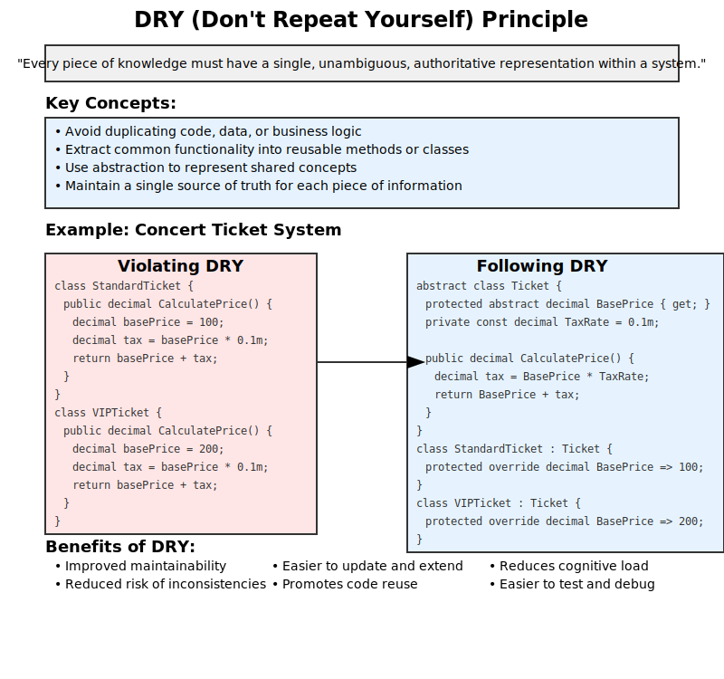
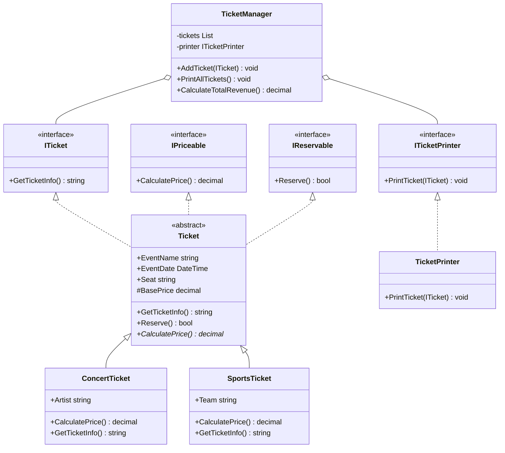

# Design Principles
## Table of Contents
- SOLID principles
- DRY (Don't Repeat Yourself)
- KISS (Keep It Simple, Stupid)
- Separation of Concerns

## DRY Principles
- Don't repeat yourself


Figure 1: (Slide 59) DRY



Example: Ticket class - follows the DRY principle.

```csharp
using System;
using System.Collections.Generic;

// DRY Violation Example
namespace DRYViolation
{
    public class RegularTicket
    {
        public string EventName { get; set; }
        public DateTime EventDate { get; set; }
        public decimal BasePrice { get; set; }

        public decimal CalculatePrice()
        {
            decimal price = BasePrice;
            
            // Apply early bird discount
            if (DateTime.Now < EventDate.AddDays(-30))
            {
                price *= 0.9m; // 10% discount
            }

            // Apply tax
            price *= 1.1m; // 10% tax

            return Math.Round(price, 2);
        }

        public string GenerateTicketInfo()
        {
            return $"Regular Ticket - {EventName} on {EventDate.ToShortDateString()}\nPrice: ${CalculatePrice()}";
        }
    }

    public class VIPTicket
    {
        public string EventName { get; set; }
        public DateTime EventDate { get; set; }
        public decimal BasePrice { get; set; }

        public decimal CalculatePrice()
        {
            decimal price = BasePrice * 1.5m; // VIP premium
            
            // Apply early bird discount
            if (DateTime.Now < EventDate.AddDays(-30))
            {
                price *= 0.9m; // 10% discount
            }

            // Apply tax
            price *= 1.1m; // 10% tax

            return Math.Round(price, 2);
        }

        public string GenerateTicketInfo()
        {
            return $"VIP Ticket - {EventName} on {EventDate.ToShortDateString()}\nPrice: ${CalculatePrice()}";
        }
    }
}

// DRY Adherence Example
namespace DRYAdherence
{
    public abstract class Ticket
    {
        public string EventName { get; set; }
        public DateTime EventDate { get; set; }
        public decimal BasePrice { get; set; }

        protected abstract decimal ApplyPremium(decimal price);

        public decimal CalculatePrice()
        {
            decimal price = ApplyPremium(BasePrice);
            
            // Apply early bird discount
            if (DateTime.Now < EventDate.AddDays(-30))
            {
                price *= 0.9m; // 10% discount
            }

            // Apply tax
            price *= 1.1m; // 10% tax

            return Math.Round(price, 2);
        }

        public string GenerateTicketInfo()
        {
            return $"{GetType().Name} - {EventName} on {EventDate.ToShortDateString()}\nPrice: ${CalculatePrice()}";
        }
    }

    public class RegularTicket : Ticket
    {
        protected override decimal ApplyPremium(decimal price)
        {
            return price; // No premium for regular tickets
        }
    }

    public class VIPTicket : Ticket
    {
        protected override decimal ApplyPremium(decimal price)
        {
            return price * 1.5m; // 50% premium for VIP tickets
        }
    }
}

// Example usage
class Program
{
    static void Main(string[] args)
    {
        Console.WriteLine("DRY Violation Example:");
        var regularTicketViolation = new DRYViolation.RegularTicket
        {
            EventName = "Rock Concert",
            EventDate = DateTime.Now.AddDays(45),
            BasePrice = 100
        };
        var vipTicketViolation = new DRYViolation.VIPTicket
        {
            EventName = "Rock Concert",
            EventDate = DateTime.Now.AddDays(45),
            BasePrice = 100
        };
        Console.WriteLine(regularTicketViolation.GenerateTicketInfo());
        Console.WriteLine(vipTicketViolation.GenerateTicketInfo());

        Console.WriteLine("\nDRY Adherence Example:");
        var regularTicketAdherence = new DRYAdherence.RegularTicket
        {
            EventName = "Rock Concert",
            EventDate = DateTime.Now.AddDays(45),
            BasePrice = 100
        };
        var vipTicketAdherence = new DRYAdherence.VIPTicket
        {
            EventName = "Rock Concert",
            EventDate = DateTime.Now.AddDays(45),
            BasePrice = 100
        };
        Console.WriteLine(regularTicketAdherence.GenerateTicketInfo());
        Console.WriteLine(vipTicketAdherence.GenerateTicketInfo());
    }
}
```

### Applied DRY with SOLID of Concert Tickets



```csharp
using System;
using System.Collections.Generic;

public interface ITicket
{
    string GetTicketInfo();
}

public interface IPriceable
{
    decimal CalculatePrice();
}

public interface IReservable
{
    bool Reserve();
}

// Base Ticket class implementing common functionality
public abstract class Ticket : ITicket, IPriceable, IReservable
{
    public string EventName { get; set; }
    public DateTime EventDate { get; set; }
    public string Seat { get; set; }
    protected decimal BasePrice { get; set; }

    // DRY: Common implementation for GetTicketInfo
    public virtual string GetTicketInfo()
    {
        return $"Event: {EventName}, Date: {EventDate}, Seat: {Seat}";
    }

    // DRY: Common implementation for Reserve
    public virtual bool Reserve()
    {
        Console.WriteLine($"{GetType().Name} reserved.");
        return true;
    }

    // Abstract method to be implemented by derived classes
    public abstract decimal CalculatePrice();
}

public class ConcertTicket : Ticket
{
    public string Artist { get; set; }

    public ConcertTicket()
    {
        BasePrice = 50.00m;
    }

    public override decimal CalculatePrice()
    {
        return BasePrice;
    }

    public override string GetTicketInfo()
    {
        return base.GetTicketInfo() + $", Artist: {Artist}";
    }
}

// New ticket type
public class SportsTicket : Ticket
{
    public string Team { get; set; }

    public SportsTicket()
    {
        BasePrice = 40.00m;
    }

    public override decimal CalculatePrice()
    {
        return BasePrice;
    }

    public override string GetTicketInfo()
    {
        return base.GetTicketInfo() + $", Team: {Team}";
    }
}

public interface ITicketPrinter
{
    void PrintTicket(ITicket ticket);
}

public class TicketPrinter : ITicketPrinter
{
    public void PrintTicket(ITicket ticket)
    {
        Console.WriteLine(ticket.GetTicketInfo());
    }
}

public class TicketManager
{
    private readonly List<ITicket> tickets;
    private readonly ITicketPrinter printer;

    public TicketManager(ITicketPrinter printer)
    {
        this.tickets = new List<ITicket>();
        this.printer = printer;
    }

    public void AddTicket(ITicket ticket)
    {
        tickets.Add(ticket);
    }

    public void PrintAllTickets()
    {
        foreach (var ticket in tickets)
        {
            printer.PrintTicket(ticket);
        }
    }

    // New function to calculate total revenue
    public decimal CalculateTotalRevenue()
    {
        decimal totalRevenue = 0;
        foreach (var ticket in tickets)
        {
            if (ticket is IPriceable priceable)
            {
                totalRevenue += priceable.CalculatePrice();
            }
        }
        return totalRevenue;
    }
}

// Usage example
public class Program
{
    public static void Main()
    {
        var ticketManager = new TicketManager(new TicketPrinter());

        var concertTicket = new ConcertTicket
        {
            EventName = "Rock Concert",
            EventDate = DateTime.Now.AddDays(30),
            Seat = "A1",
            Artist = "Rock Band"
        };

        var sportsTicket = new SportsTicket
        {
            EventName = "Football Match",
            EventDate = DateTime.Now.AddDays(15),
            Seat = "B5",
            Team = "Local Team"
        };

        ticketManager.AddTicket(concertTicket);
        ticketManager.AddTicket(sportsTicket);

        ticketManager.PrintAllTickets();

        Console.WriteLine($"Total Revenue: ${ticketManager.CalculateTotalRevenue()}");
    }
}
```
