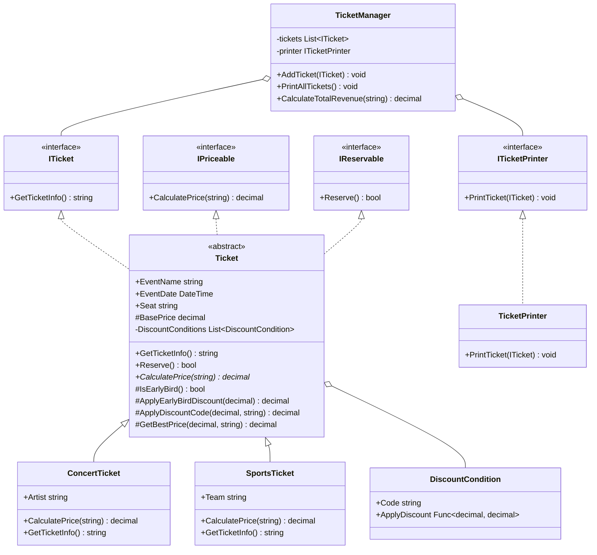

# Design Principles
## Table of Contents
- SOLID principles
- DRY (Don't Repeat Yourself)
- KISS (Keep It Simple, Stupid)
- Separation of Concerns

## KISS Principles
- Keep it Simple, Stupid


Figure 1: (Slide 63) KISS Principles


Example: Ticket class - follows the KISS principle.

```csharp
using System;

// Violating KISS
class TicketPriceCalculator
{
    public decimal CalculatePrice(
        Ticket ticket, DateTime purchaseDate,
        bool isVIP, bool isEarlyBird,
        int customerLoyaltyPoints)
    {
        decimal price = ticket.BasePrice;
        if (isVIP) price *= 1.5m;
        if (isEarlyBird) price *= 0.9m;
        price -= (customerLoyaltyPoints / 100);
        if (purchaseDate.DayOfWeek == DayOfWeek.Tuesday)
            price *= 0.95m;
        return Math.Max(price, 0);
    }
}

// Following KISS
abstract class Ticket
{
    public decimal BasePrice { get; set; }
    public abstract decimal CalculatePrice();
}

class RegularTicket : Ticket
{
    public override decimal CalculatePrice()
    {
        return BasePrice;
    }
}

class VIPTicket : Ticket
{
    public override decimal CalculatePrice()
    {
        return BasePrice * 1.5m;
    }
}

// Example usage
class Program
{
    static void Main(string[] args)
    {
        Console.WriteLine("Violating KISS:");
        var calculator = new TicketPriceCalculator();
        var ticket = new Ticket() { BasePrice = 100 };
        var price = calculator.CalculatePrice(ticket, DateTime.Now, true, false, 50);
        Console.WriteLine($"Calculated Price: {price}");

        Console.WriteLine("\nFollowing KISS:");
        Ticket regularTicket = new RegularTicket() { BasePrice = 100 };
        Ticket vipTicket = new VIPTicket() { BasePrice = 100 };
        Console.WriteLine($"Regular Ticket Price: {regularTicket.CalculatePrice()}");
        Console.WriteLine($"VIP Ticket Price: {vipTicket.CalculatePrice()}");
    }
}

// Note: This Ticket class is only used for the "Violating KISS" example
class Ticket
{
    public decimal BasePrice { get; set; }
}

```

### Applied KISS with DRY and SOLID of Concert Tickets



```csharp
using System;
using System.Collections.Generic;
using System.Linq;

public interface ITicket
{
    string GetTicketInfo();
}

public interface IPriceable
{
    decimal CalculatePrice(string discountCode);
}

public interface IReservable
{
    bool Reserve();
}

public class DiscountCondition
{
    public string Code { get; }
    public Func<decimal, decimal> ApplyDiscount { get; }

    public DiscountCondition(string code, Func<decimal, decimal> applyDiscount)
    {
        Code = code;
        ApplyDiscount = applyDiscount;
    }
}

public abstract class Ticket : ITicket, IPriceable, IReservable
{
    public string EventName { get; set; }
    public DateTime EventDate { get; set; }
    public string Seat { get; set; }
    protected decimal BasePrice { get; set; }

    protected static readonly List<DiscountCondition> DiscountConditions = new List<DiscountCondition>
    {
        new DiscountCondition("SAVE10", price => price * 0.9m),
        new DiscountCondition("SAVE20", price => price * 0.8m),
        new DiscountCondition("HALF", price => price * 0.5m)
    };

    public virtual string GetTicketInfo()
    {
        return $"Event: {EventName}, Date: {EventDate}, Seat: {Seat}";
    }

    public virtual bool Reserve()
    {
        Console.WriteLine($"{GetType().Name} reserved.");
        return true;
    }

    public abstract decimal CalculatePrice(string discountCode);

    protected bool IsEarlyBird()
    {
        return DateTime.Now < EventDate.AddDays(-30);
    }

    protected decimal ApplyEarlyBirdDiscount(decimal price)
    {
        return price * 0.85m; // 15% off for early bird
    }

    protected decimal ApplyDiscountCode(decimal price, string discountCode)
    {
        return DiscountConditions
            .Where(dc => dc.Code == discountCode?.ToUpper())
            .Select(dc => dc.ApplyDiscount(price))
            .DefaultIfEmpty(price)
            .First();
    }

    protected decimal GetBestPrice(decimal basePrice, string discountCode)
    {
        decimal earlyBirdPrice = IsEarlyBird() ? ApplyEarlyBirdDiscount(basePrice) : basePrice;
        decimal discountCodePrice = ApplyDiscountCode(basePrice, discountCode);
        
        return Math.Min(earlyBirdPrice, discountCodePrice);
    }
}

public class ConcertTicket : Ticket
{
    public string Artist { get; set; }

    public ConcertTicket()
    {
        BasePrice = 100.00m;
    }

    public override decimal CalculatePrice(string discountCode)
    {
        return GetBestPrice(BasePrice, discountCode);
    }

    public override string GetTicketInfo()
    {
        return base.GetTicketInfo() + $", Artist: {Artist}";
    }
}

public class SportsTicket : Ticket
{
    public string Team { get; set; }

    public SportsTicket()
    {
        BasePrice = 80.00m;
    }

    public override decimal CalculatePrice(string discountCode)
    {
        return GetBestPrice(BasePrice, discountCode);
    }

    public override string GetTicketInfo()
    {
        return base.GetTicketInfo() + $", Team: {Team}";
    }
}

public interface ITicketPrinter
{
    void PrintTicket(ITicket ticket);
}

public class TicketPrinter : ITicketPrinter
{
    public void PrintTicket(ITicket ticket)
    {
        Console.WriteLine(ticket.GetTicketInfo());
    }
}

public class TicketManager
{
    private readonly List<ITicket> tickets;
    private readonly ITicketPrinter printer;

    public TicketManager(ITicketPrinter printer)
    {
        this.tickets = new List<ITicket>();
        this.printer = printer;
    }

    public void AddTicket(ITicket ticket)
    {
        tickets.Add(ticket);
    }

    public void PrintAllTickets()
    {
        foreach (var ticket in tickets)
        {
            printer.PrintTicket(ticket);
        }
    }

    public decimal CalculateTotalRevenue(string discountCode = null)
    {
        return tickets
            .OfType<IPriceable>()
            .Select(ticket => ticket.CalculatePrice(discountCode))
            .Sum();
    }
}

// Usage example
public class Program
{
    public static void Main()
    {
        var ticketManager = new TicketManager(new TicketPrinter());

        var concertTicket = new ConcertTicket
        {
            EventName = "Rock Concert",
            EventDate = DateTime.Now.AddDays(60),
            Seat = "A1",
            Artist = "Rock Band"
        };

        var sportsTicket = new SportsTicket
        {
            EventName = "Football Match",
            EventDate = DateTime.Now.AddDays(15),
            Seat = "B5",
            Team = "Local Team"
        };

        ticketManager.AddTicket(concertTicket);
        ticketManager.AddTicket(sportsTicket);

        ticketManager.PrintAllTickets();

        Console.WriteLine($"Total Revenue (No Discount): ${ticketManager.CalculateTotalRevenue()}");
        Console.WriteLine($"Total Revenue (With SAVE10): ${ticketManager.CalculateTotalRevenue("SAVE10")}");
        Console.WriteLine($"Total Revenue (With SAVE20): ${ticketManager.CalculateTotalRevenue("SAVE20")}");
        Console.WriteLine($"Total Revenue (With HALF): ${ticketManager.CalculateTotalRevenue("HALF")}");
    }
}
```
