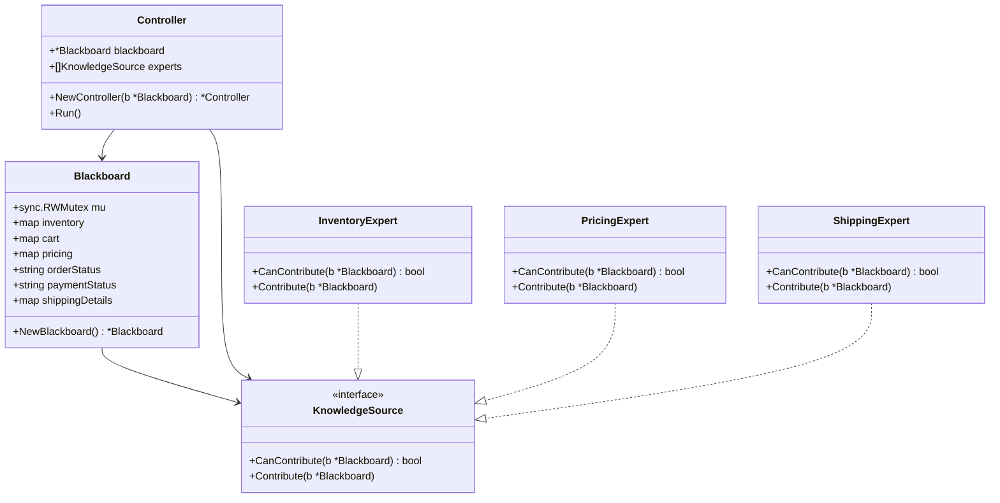
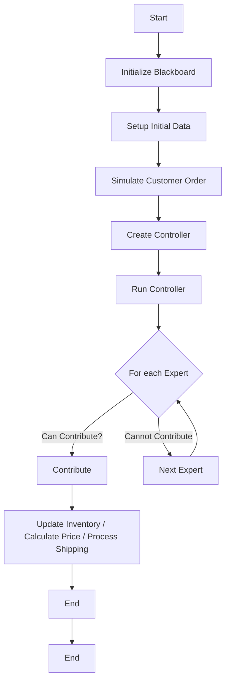

The provided Go code implements a simple system for managing a shared knowledge base called `Blackboard`, which is used to handle inventory, pricing, and shipping logistics for a shopping cart scenario. Here's a breakdown of the main components:

1. **Blackboard Structure**: 
   - The `Blackboard` struct holds various fields such as `inventory`, `cart`, `pricing`, `orderStatus`, `paymentStatus`, and `shippingDetails`. It uses a `sync.RWMutex` to manage concurrent access to these fields safely.

2. **NewBlackboard Function**: 
   - This function initializes a new `Blackboard` instance with empty maps for `inventory`, `cart`, `pricing`, and `shippingDetails`.

3. **KnowledgeSource Interface**: 
   - This interface defines two methods: `CanContribute` and `Contribute`, which are implemented by different expert types to interact with the `Blackboard`.

4. **Expert Types**:
   - **InventoryExpert**: Checks if there are items in the cart and updates the inventory based on the cart contents.
   - **PricingExpert**: Calculates the total price of items in the cart if there are items and pricing information available.
   - **ShippingExpert**: Processes shipping if the order status is "PAID" and shipping details are provided.

5. **Controller Struct**: 
   - The `Controller` orchestrates the interaction between the `Blackboard` and the various experts. It holds a reference to the `Blackboard` and a slice of `KnowledgeSource` experts.

6. **Run Method**: 
   - This method iterates through the experts and calls their `Contribute` method if they can contribute based on the current state of the `Blackboard`.

7. **Main Function**: 
   - The `main` function initializes a `Blackboard`, sets up initial inventory and pricing data, simulates a customer order, and runs the `Controller` to process the order through the experts.

Overall, this code demonstrates a basic implementation of the blackboard architectural pattern, where multiple experts contribute to a shared knowledge base to perform tasks related to inventory management, pricing calculation, and shipping logistics.

