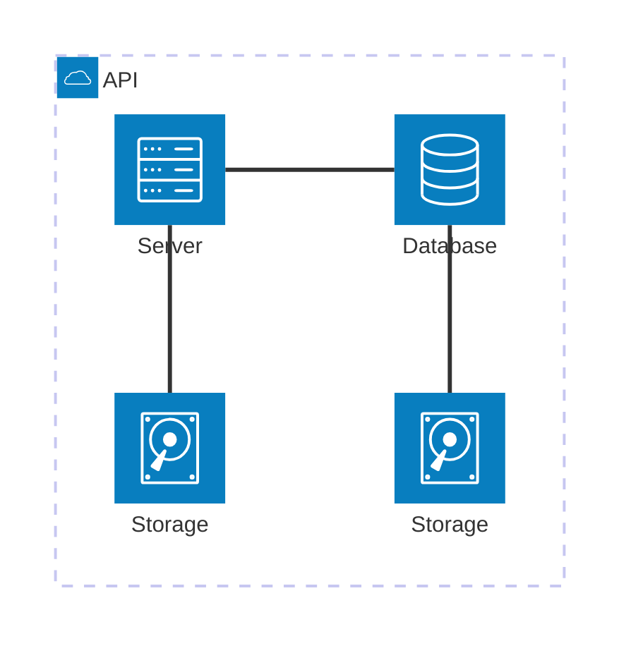

# Title: High-Volume Payment Gateway for Multiple Partners
## Background:
A payment gateway service is handling transactions for 1000 different partners. Each partner processes an average of 10,000 payments per day through API calls to the gateway.
### Key Points:

1. Number of Partners: 1000
2. Average Daily Transactions per Partner: 10,000
3. Total Daily Transactions: 10,000,000 (10 million)
4. Interface: API-based

## Use Case Description:
Design a scalable and reliable payment gateway architecture that can handle a high volume of transactions from multiple partners.
### Requirements:

1. High Availability: The system must be available 24/7 with minimal downtime.
2. Scalability: Must handle 10 million transactions per day with the ability to scale up.
3. Performance: Low latency response times for API calls.
4. Security: Ensure secure handling of sensitive payment information.
5. Partner Management: Ability to onboard, manage, and monitor 1000+ partners.
6. API Design: Robust API design to handle various payment scenarios.
7. Monitoring and Logging: Real-time monitoring of transaction flows and error logging.
8. Compliance: Adhere to relevant financial regulations and standards (e.g., PCI DSS).

### Challenges to Address:

1. Load Balancing: Efficiently distribute incoming API requests across multiple servers.
2. Database Design: Design a database structure that can handle high write loads.
3. Caching Strategy: Implement caching to reduce database load and improve response times.
4. Asynchronous Processing: Consider asynchronous processing for non-critical operations.
5. Partner Isolation: Ensure that issues with one partner don't affect others.
6. Rate Limiting: Implement rate limiting to prevent any single partner from overwhelming the system.
7. Disaster Recovery: Design a robust backup and recovery system.
8. Scalability: Architect the system to easily scale horizontally as the number of partners or transactions increases.

## Discussion Points for the Workshop:

1. What architectural pattern would be most suitable? (e.g., microservices, event-driven)
2. How to design the API for optimal performance and usability?
3. What database technology would be most appropriate for this use case?
4. How to implement real-time monitoring and alerting for such a high-volume system?
5. What security measures should be in place to protect sensitive payment data?
6. How to handle peak loads and traffic spikes?
7. What kind of redundancy should be built into the system?
8. How to manage and version the API for 1000 different partners?


```d2
Frontend.shape: package

Frontend: {
  WebPortal: {
    React
  }
  backoffice: Back Office Web {
    Vue
  }
  mobile: Mobile {
    android: Android
    ios: IOS
  }
}

Middleware: {
  lb: Load Balance
  apigw: Api Gateway
  lb -> apigw
}

Backend: {
  partner: Partner Api
  payment: Payment Api
  inquiry: Inquiry Api
  tokenize: Tokennize Api
  authen: Authentication Api
  paymentproc: Payment Processing
}

Database: {
  mq: Message Queue
  mq.shape: queue
  db: Payment DB
  db.shape: cylinder
  mem: Cache
  mem.redis: Redis
  mem.shape: circle
}

Frontend -> Middleware -> Backend -> Database

Backend.payment -> Database.mq
Backend.paymentproc -> Database.mq: Consume Payment Message to process
Backend.paymentproc -> Database.db: Save payment transaction and status
Backend.authen -> Database.db: Read user info
Backend.authen -> Database.mem: R/W cache

```



```d2
# Define the main components
client: Client
lb: Load Balancer {
  label: "Load Balancer\n1,200 TPS"
}
api: API Gateway {
  label: "API Gateway\n1,000 TPS"
}
mq: Message Queue {
  label: "Message Queue\n800 TPS"
}
cache: Cache {
  shape: cylinder
  label: "Cache\nRead: 5,000 TPS\nWrite: 1,000 TPS"
}
db: Database {
  shape: cylinder
  label: "Database\nRead: 2,000 TPS\nWrite: 500 TPS"
}
core: Core Payment Process {
  label: "Core Payment Process\n700 TPS"
}

# Define the connections
client -> lb: HTTP/HTTPS
lb -> api: HTTP/HTTPS
api -> mq: Enqueue payment request
api -> cache: Read/Write
api -> db: Read/Write
mq -> core: Dequeue payment request
core -> cache: Read/Write
core -> db: Read/Write

# Add a legend for traffic load
legend: {
  title: Payment Gateway Traffic
  avg: Average Load: 500 TPS
  peak: Peak Load: 5,000 TPS
}

# Add notes
notes: {
  cache_note: Cache used for storing session data,\nuser preferences, and frequently accessed data
  db_note: Database stores transaction history,\nuser accounts, and payment details
  mq_note: Message Queue helps in\nhandling traffic spikes and\nasynchronous processing
}

notes.cache_note -> cache
notes.db_note -> db
notes.mq_note -> mq
```
